# 18. 사용설명서 — 팀원용

TeamFlow AI 를 **처음 여는 사람**이 읽는 글입니다. 화면 순서대로 따라가면
이 제품이 무엇을 하는지 알 수 있습니다.

아래 화면은 전부 **실제로 돌려서 찍은 것**입니다 — 그림으로 그린 것이
아니라 시연 데이터를 넣고 브라우저로 연 화면입니다.

---

## 0. 한 줄로 말하면

> **회의에서 정한 것이 업무가 되고, 업무와 GitHub 활동이 기여도가 되고,
> 그 기여도는 사람이 확정합니다.**

```
회의 통화 → 녹음 → 화자별 자막 → 업무 후보 → 사람이 승인 → 칸반
                                                          ↓
                                    관련 PR 병합 → 업무 카드에 근거
                                                          ↓
   발언 유형을 매겨 기여 이벤트로  ──→  기여도 화면  ──→  사람이 확정
```

**시스템은 판정하지 않습니다.** 숫자를 계산해서 근거와 함께 보여주고,
확정은 팀이 합니다. 이게 이 프로젝트의 중심 약속입니다.

---

## 1. 로그인

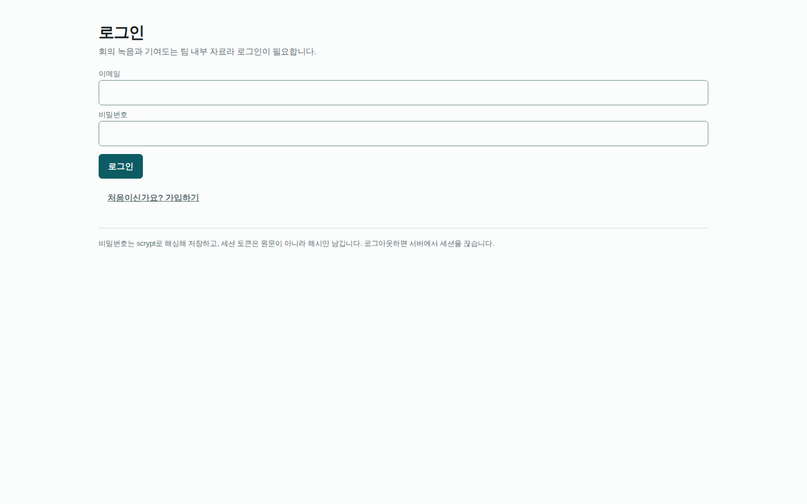

이메일과 비밀번호로 들어갑니다. 세션은 쿠키에 담기고, **주소에 누가
누구인지 적지 않습니다** — 남의 번호를 적어 남인 척하는 것을 막기
위해서입니다.

시연 계정은 셋입니다 (비밀번호는 모두 `teamflow-demo`).

| 이메일 | 이름 | 역할 |
|---|---|---|
| `minsu@example.com` | 김민수 | 개발 100% |
| `haneul@example.com` | 이하늘 | 개발 70% · 기획 30% |
| `jiwon@example.com` | 박지원 | 개발 60% · 디자인 40% |

---

## 2. 홈 — 지금 할 일이 무엇인지

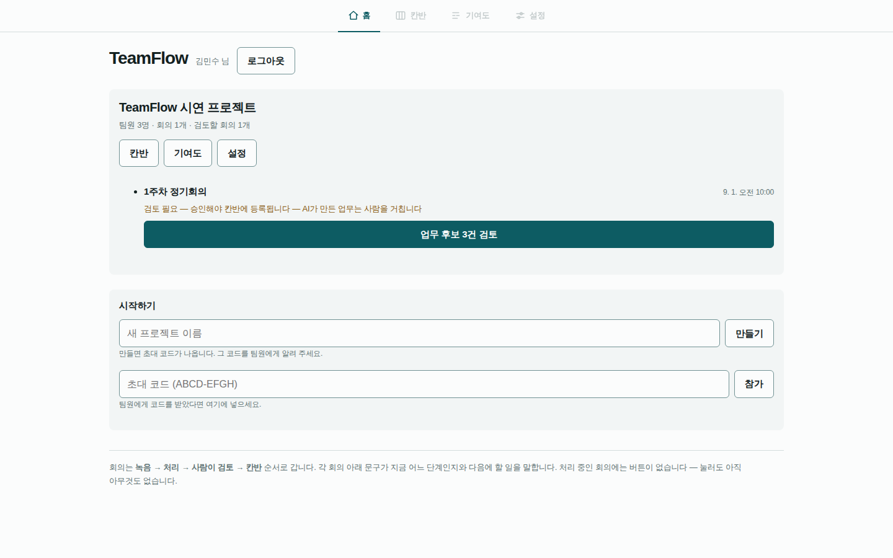

**시작점입니다.** 어떤 번호도 몰라도 여기서 다 갈 수 있습니다.

- 프로젝트마다 **칸반 · 기여도 · 설정** 버튼이 붙습니다
- 회의마다 **지금 어느 단계인지**와 **다음에 할 일**이 한 줄로 나옵니다
  (`검토 필요 — 승인해야 칸반에 등록됩니다`)
- 처리 중인 회의에는 **버튼이 없습니다** — 눌러도 아직 아무것도 없기
  때문입니다

새 프로젝트를 만들면 **초대 코드**가 나옵니다. 그 코드를 팀원에게 주면
팀원이 아래 칸에 넣고 들어옵니다. **남을 강제로 넣을 수 없습니다** —
이 시스템에서 팀원 명단은 곧 권한이라, 본인이 직접 들어와야 합니다.

---

## 3. 설정 — 내 역할과 내 GitHub 계정

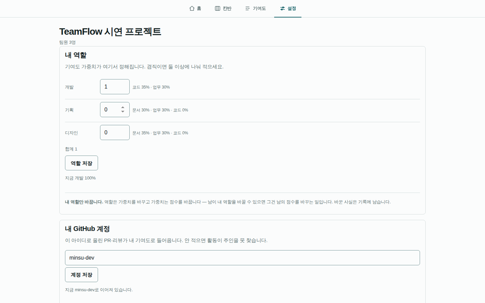

두 가지를 여기서 정합니다.

### 내 역할

역할은 **기여도 가중치**를 정합니다. 개발이면 코드 35% · 업무 30%,
기획이면 문서 30% · 업무 30% 같은 식입니다. **겸직이면 둘 이상에 나눠
적습니다** — 옆에 그 역할의 가중치가 바로 보입니다.

⚠️ **내 역할만 바꿉니다.** 남이 내 역할을 바꿀 수 있으면 그건 남의 점수를
바꾸는 일입니다. 바꾼 사실은 기록에 남습니다.

### 내 GitHub 계정

이 아이디로 올린 PR·리뷰가 내 기여도로 들어옵니다. **안 적으면 활동이
주인을 못 찾습니다** — 오류는 안 나고 기여도만 빕니다.

주소를 통째로 붙여 넣어도 됩니다 (`https://github.com/minsu` → `minsu`).
같은 팀의 다른 사람이 이미 쓰는 아이디는 빨갛게 거절합니다.

이 아래에는 **GitHub 연결 진단**이 있습니다 — 웹훅이 몇 건 왔고 그중 몇
건이 주인을 못 찾았는지 이름을 불러서 말합니다.

---

## 4. 회의 로비 — 동의와 트랙 상태

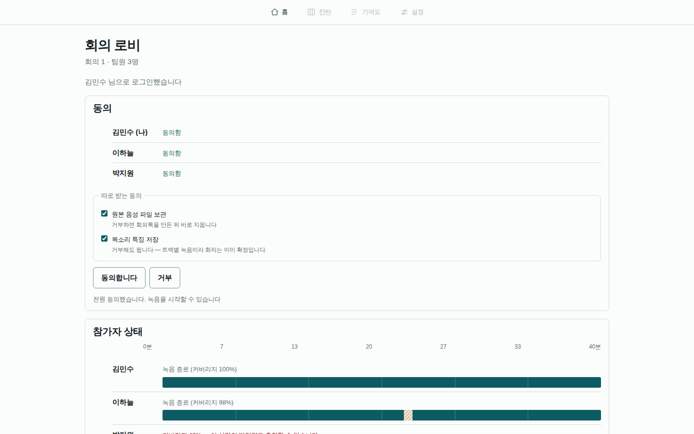

회의를 시작하기 전에 여는 화면입니다.

### 동의 (법적 요구사항)

녹음은 **전원이 동의해야** 시작할 수 있습니다. 화면이 누가 아직 답을 안
했는지 **이름으로** 말합니다.

동의는 세 단계입니다.

| 무엇 | 거부하면 |
|---|---|
| 회의 녹음 자체 | 녹음을 시작할 수 없습니다 |
| **원본 음성 파일 보관** | 회의록을 만든 뒤 **바로 지웁니다** (텍스트만 남습니다) |
| **목소리 특징 저장** | 거부해도 됩니다 — 트랙별 녹음이라 화자는 이미 확정입니다 |

⚠️ 거부는 저장만 되는 것이 아니라 **실제로 그렇게 동작합니다.** 전사가
끝나면 거부한 사람의 원본이 그 자리에서 지워집니다.

### 참가자 상태 — 운행도표

아래쪽 가로 막대가 이 제품의 시그니처입니다. **누가 언제 녹음이
끊겼는지**를 시간축 위에 그립니다.

- 꽉 찬 막대 = 커버리지 100%
- 빗금 = 그 시각에 구멍이 났다는 뜻
- 커버리지가 낮으면 빨갛게 **"이 사람의 발언량은 측정할 수 없습니다"**

**끊긴 것을 0점으로 만들지 않습니다.** 못 쟀다는 것과 안 했다는 것은
다르기 때문입니다 — 이 구분이 기여도 화면까지 그대로 이어집니다.

---

## 5. 통화 — 브라우저에서 바로

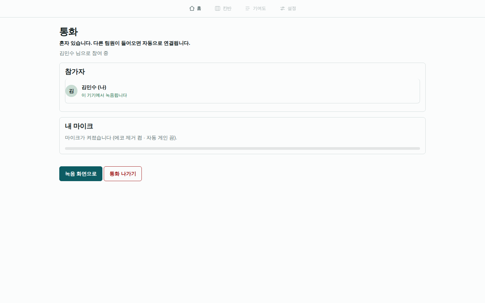

각자 자기 PC 앞에서 브라우저로 통화합니다 (WebRTC 메시). 별도 프로그램을
깔지 않습니다.

**말하는 목소리는 각자의 브라우저가 각자 녹음합니다** — 통화 소리를
녹음하는 것이 아니라 사람당 트랙 하나가 만들어집니다. 그래서 "누가 무엇을
말했나" 가 추정이 아니라 사실이 됩니다.

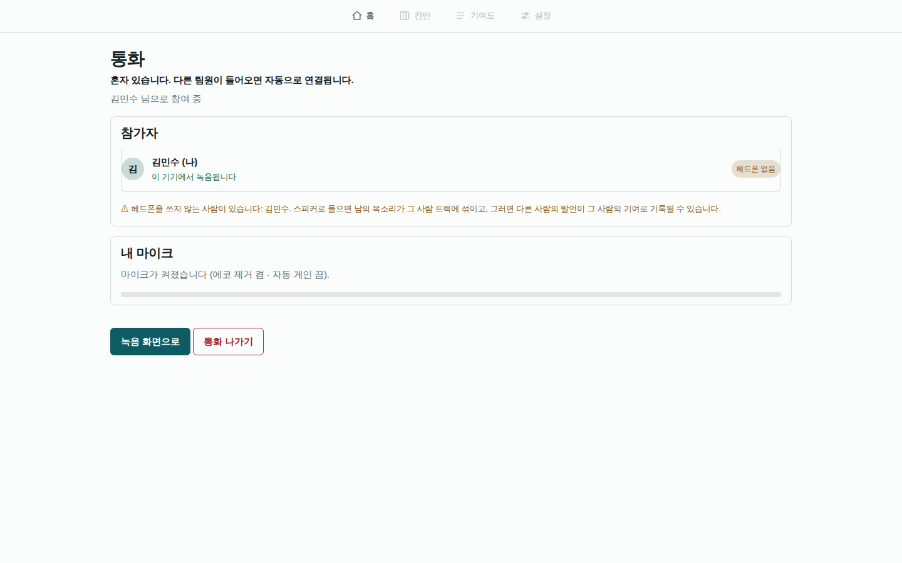

⚠️ **헤드폰을 안 쓰면 경고가 뜹니다.** 스피커로 들으면 남의 목소리가 내
마이크로 새어 들어가고, 그러면 남의 발언이 내 발언량에 섞입니다.

---

## 6. 녹음

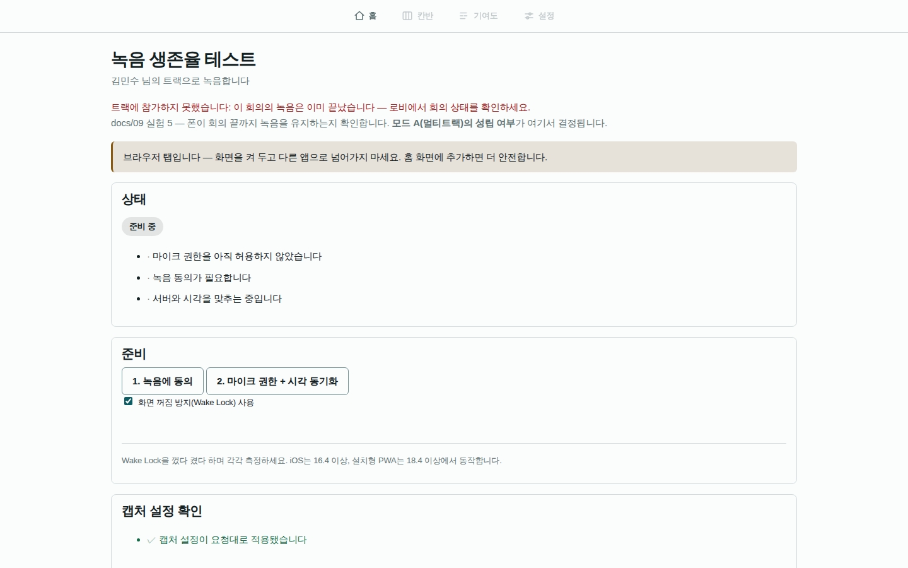

준비 단계가 순서대로 나옵니다 — **녹음 동의 → 마이크 권한 + 시각
동기화**. 각 단계가 끝나야 다음이 열립니다.

- **화면 꺼짐 방지(Wake Lock)** 를 켜 두면 화면이 꺼져도 녹음이 이어집니다
- 5초짜리 조각으로 계속 올라가므로 중간에 끊겨도 그때까지는 남습니다
- **캡처 설정 확인** — 자동 게인·잡음 억제가 꺼졌는지 봅니다. 켜져 있으면
  발언량 측정이 왜곡됩니다

위 그림은 **이미 끝난 회의**를 연 것이라 빨간 안내가 떠 있습니다 —
*"트랙에 참가하지 못했습니다: 이 회의의 녹음은 이미 끝났습니다 — 로비에서
회의 상태를 확인하세요."* 이렇게 **왜 안 되는지와 다음에 할 일**을 같이
말하는 것이 이 제품의 규칙입니다.

---

## 7. 업무 후보 검토 — **여기가 사람이 개입하는 지점입니다**

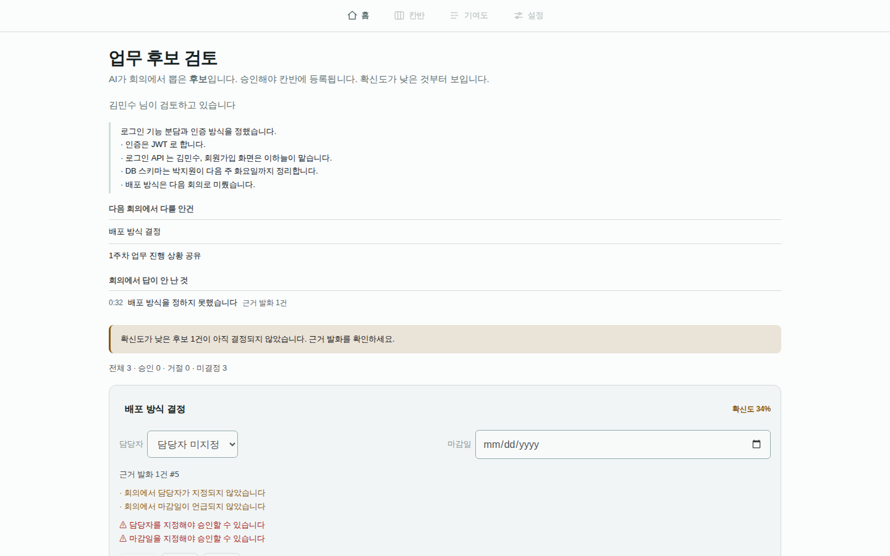

AI 가 회의에서 뽑은 것은 **후보**입니다. 승인해야 칸반에 올라갑니다.

위쪽에는 회의록이 있습니다.

- **회의 요약**과 그 아래 결정 목록
- **다음 회의에서 다룰 안건**
- **회의에서 답이 안 난 것** — 시각(`0:32`)과 근거 발화 건수까지

아래는 후보 카드입니다. **확신도가 낮은 것부터** 나옵니다.

- 담당자·마감일을 그 자리에서 고칠 수 있습니다
- **근거 발화 번호**가 붙습니다 — 회의에서 실제로 뭐라고 했는지 거슬러
  올라갈 수 있습니다
- ⚠️ 빨간 줄이 **승인을 막습니다**: `담당자를 지정해야 승인할 수 있습니다`
- 확신도를 깎은 이유가 그대로 적힙니다 (`회의에서 마감일이 언급되지
  않았습니다`)

**빈 채로 승인되지 않습니다.** 담당자 없는 업무는 완료해도 누구의
기여인지 알 수 없기 때문입니다.

---

## 8. 칸반

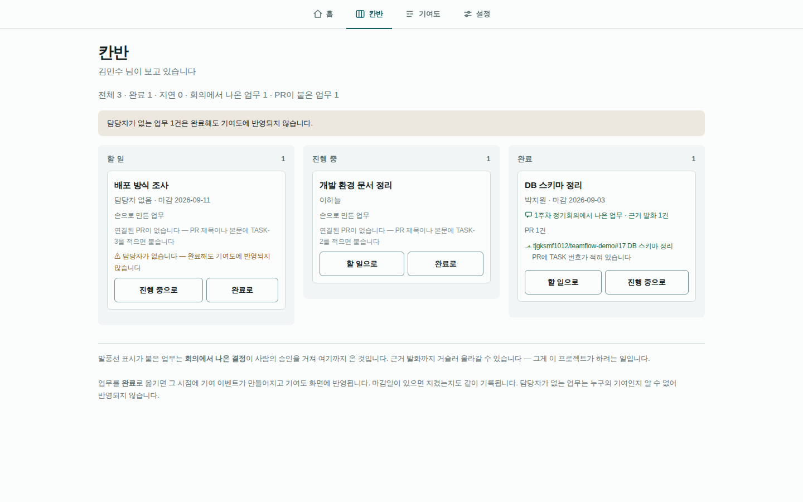

승인된 업무가 여기 올라옵니다. 열은 셋 — **할 일 · 진행 중 · 완료**.

- 말풍선 표시(💬)가 붙은 카드는 **회의에서 나온 결정**이 사람의 승인을
  거쳐 여기까지 온 것입니다. **근거 발화까지 거슬러 올라갈 수 있습니다**
- `PR 1건` 아래에 실제 PR 링크가 붙습니다. **PR 제목이나 본문에
  `TASK-3` 을 적으면** 자동으로 붙습니다 — 카드가 그 방법을 그 자리에서
  알려 줍니다
- 담당자가 없는 카드는 **회색 경고**가 붙습니다: *완료해도 기여도에
  반영되지 않습니다*
- 마감일이 지나면 **지연**으로 셉니다 (팀 시간대 기준 — 보는 사람의
  시간대가 아니라 팀의 달력으로 잽니다)

업무를 **완료**로 옮기면 그 시점에 기여 이벤트가 만들어지고 기여도 화면에
반영됩니다.

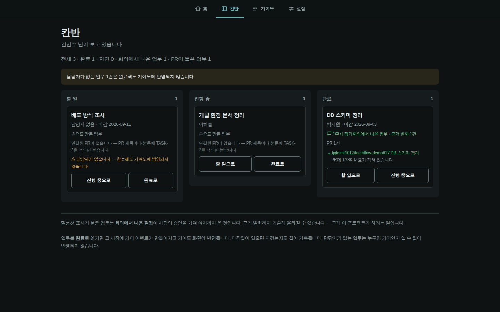

다크 모드도 됩니다. 화면 색은 브라우저 설정을 따라갑니다.

---

## 9. 기여도 — 이 제품이 하려는 일

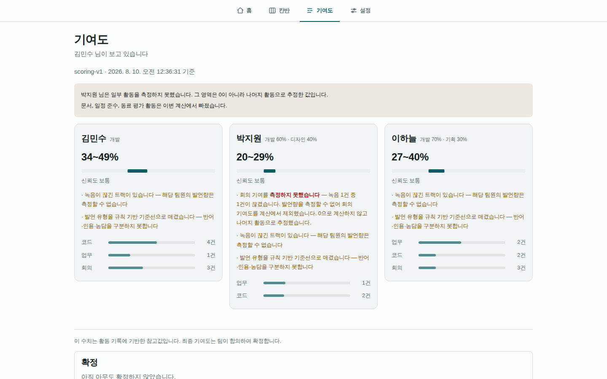

**이 화면이 지키는 네 가지가 이 프로젝트의 성격을 정합니다.**

### ① 순위를 매기지 않습니다

1등·2등이 없습니다. 리더보드도 없습니다. 같은 숫자라도 **순위로 보이는
순간 서비스의 성격이 바뀌기 때문**입니다.

### ② 단일 점수를 주지 않습니다 — 구간 + 신뢰도 + 근거

`34~49%` 처럼 **구간**으로 나옵니다. 그 아래 **신뢰도**(보통·높음·낮음)가
붙고, 그 아래 **왜 그 신뢰도인지**가 문장으로 적힙니다.

> · 녹음이 끊긴 트랙이 있습니다 — 해당 팀원의 발언량은 측정할 수 없습니다
> · 발언 유형을 규칙 기반 기준선으로 매겼습니다 — 반어·인용·농담을
>   구분하지 못합니다

**숫자보다 이 문장이 먼저 읽히게** 배치했습니다.

### ③ 측정 불가 ≠ 0점

박지원 님의 카드를 보세요.

> 회의 기여를 **측정하지 못했습니다** — 녹음 1건 중 1건이 끊겼습니다.
> 발언량을 측정할 수 없어 회의 기여도를 계산에서 제외했습니다.
> **0으로 계산하지 않고 나머지 활동으로 추정했습니다.**

못 잰 항목을 0점으로 넣으면 **활동을 안 한 것처럼 보입니다.** 이 값은
성적에 쓰일 수 있으므로, 조용히 0 이 되는 것은 버그가 아니라 **오답**
입니다. 그래서 그 항목을 빼고 나머지 가중치를 다시 나눕니다.

팀 전체에 없는 항목도 같습니다 — 위쪽 안내가 그렇게 말합니다:
*문서, 일정 준수, 동료 평가 활동은 이번 계산에서 빠졌습니다.*

### ④ 시스템은 판정하지 않습니다 — 사람이 확정합니다

맨 아래 **확정** 표에서 시스템 값과 확정값이 나란히 놓입니다. 팀이
합의해서 고치고 **누가 확정했는지**가 화면과 기록 양쪽에 남습니다.

> 이 수치는 활동 기록에 기반한 참고값입니다. 최종 기여도는 팀이 합의하여
> 확정합니다.

카드 아래쪽 **항목별 막대**(코드 4건 · 업무 1건 · 회의 3건)가 근거의
개수입니다. 조작 신호(예: 맞장구만 많은 경우)가 있으면 표시만 하고
**점수를 깎지 않습니다** — 판단은 팀이 합니다.

---

## 10. 연결이 끊겼을 때

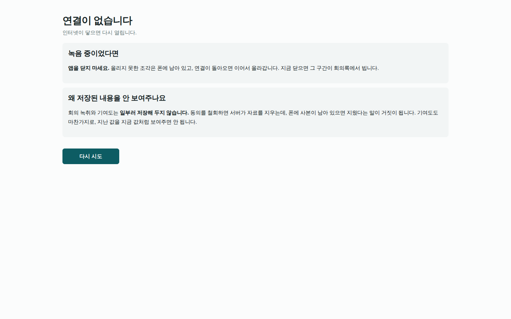

인터넷이 끊기면 이 화면이 뜹니다. **두 가지를 말합니다.**

**① 녹음 중이었다면 앱을 닫지 마세요.** 올리지 못한 조각은 기기에 남아
있고, 연결이 돌아오면 이어서 올라갑니다. 지금 닫으면 그 구간이 회의록에서
빕니다.

**② 저장된 내용을 일부러 안 보여줍니다.**

> 회의 녹취와 기여도는 **일부러 저장해 두지 않습니다.** 동의를 철회하면
> 서버가 자료를 지우는데, 폰에 사본이 남아 있으면 지웠다는 말이 거짓이
> 됩니다. 기여도도 마찬가지로, 지난 값을 지금 값처럼 보여주면 안 됩니다.

오프라인 캐시를 안 쓰는 것이 **기능 부족이 아니라 결정**이라는 뜻입니다.

그리고 화면 안에서 요청이 실패할 때도 마찬가지입니다 — 끊긴 채로 버튼을
누르면 **"저장했습니다" 가 남지 않고** 무엇이 안 됐는지를 그 자리에서
말합니다.

---

## 11. 직접 돌려 보려면

가장 빠른 길은 **SQLite** 로 여는 것입니다. PostgreSQL·Redis·Docker 없이
됩니다.

```bash
# 0) 이 창에서 계속 쓸 값 (SQLite 로 열기)
export DATABASE_URL="sqlite:///demo.db"

# 1) 준비 (한 번만)
python3 -m venv .venv && .venv/bin/pip install -e ".[dev]"
.venv/bin/alembic upgrade head          # 스키마 생성

# 2) 시연 데이터 넣기
.venv/bin/python scripts/seed_demo.py --reset

# 3) 서버 띄우기
ASR_BACKEND=fake .venv/bin/uvicorn teamflow.api.main:app --app-dir backend
```

**Node 는 필요 없습니다.** 화면 번들(`frontend/public/*.js`)은 **일부러
저장소에 커밋돼 있습니다** — 이 프로젝트는 프런트에 런타임 의존성이 0개이고
"설치 없이 연다" 가 시연 경로의 전제입니다. `.gitignore` 에 그 이유가 적혀
있습니다.

프런트 **소스**(`frontend/src/`)를 고쳤을 때만 다시 만들면 됩니다.

```bash
npm --prefix frontend install       # 개발 의존성 3개
npm --prefix frontend run build:demo
```

그다음 <http://localhost:8000/login.html> 을 열고 위의 시연 계정으로
들어가면 됩니다.

⚠️ `DATABASE_URL` 을 안 정하면 기본값이 **PostgreSQL** 이라 5432 로
붙으려다 실패합니다. 위 `export` 를 alembic·seed·uvicorn **셋 다**
같은 창에서 하세요.

⚠️ 예전 판에는 여기에 **"번들을 만들지 않으면 빈 화면이 뜬다"** 고 적혀
있었습니다. **틀렸습니다.** 번들은 커밋돼 있습니다 — 네트워크가 없는
평가용 PC 에서 그 안내를 따르면 오히려 막힙니다.

검사를 돌려 보려면:

```bash
.venv/bin/python -m pytest backend -q       # 백엔드
npm --prefix frontend test                  # 프런트 (설치 없이 돕니다)
```

---

## 12. 지금 되는 것 · 아직 안 되는 것

**지어내지 않고 있는 그대로 적습니다.** 시연 화면에 보이는 것이 전부
실제로 도는 것은 아닙니다.

| 무엇 | 상태 | 설명 |
|---|---|---|
| 팀·프로젝트·칸반·마감일·역할 | ✅ | 초대 코드로 팀원 합류까지 |
| 회의 후보 → 승인 → 칸반 → 기여도 | ✅ | **이 제품의 대표 주장. 브라우저로 끝까지 확인했습니다** |
| 멀티트랙 녹음·정렬·누출 제거 | ✅ | 사람당 트랙 하나 |
| 동의 3단계 · 보존기간 삭제 | ✅ | 거부가 실제로 동작합니다 |
| 브라우저 통화(WebRTC) | ✅ / 🟡 | **같은 기기 안 3인 통화는 실제로 붙는 것을 확인했습니다**(host 후보로 직접 연결 — STUN 도 인터넷도 필요 없습니다). 확인 못 한 것은 **서로 다른 NAT 뒤 · 대칭 NAT(TURN) · 가정용 업로드에서 5명** 입니다 |
| GitHub 연동 | 🟡 | 코드·테스트는 있지만 **실제 GitHub 에 붙여 본 적이 없습니다** — App ID·개인 키·공개 URL 이 필요합니다 |
| STT (Qwen3-ASR) | 🟡 | 인터페이스는 됐고 `ASR_BACKEND=fake` 로 파이프라인을 검증했습니다. **모델은 GPU 가 없어 못 돌렸습니다** |
| 업무 추출 LLM | 🟡 | 스키마·환각 방어는 됐고 **LLM 은 못 돌렸습니다** |
| 발언 분류 (KLUE-RoBERTa) | 🟡 | 지금은 **규칙 기반 기준선**입니다. 화면이 그렇게 말합니다 |
| 오디오 암호화 | ❌ | **평문입니다.** 볼륨만 분리돼 있고, 문서·설정·검사가 전부 그렇게 말합니다 |
| 동료평가 제출 화면 | ❌ | 표와 계산식은 있는데 **제출할 화면이 없습니다.** 그래서 신뢰도 계산에서 빼 둡니다 |
| 보고서(회의록·주간·최종) | ❌ | 표만 있고 쓰는 코드가 없습니다 |
| 안드로이드 앱 | ⏸ | 셸은 있지만 **실기기가 없어 한 번도 못 돌렸습니다.** `docs/15` 에서 PC 우선으로 방향을 바꿨습니다 |

---

## 13. 더 읽을 것

| 문서 | 무엇 |
|---|---|
| `docs/15-PC-우선-방향.md` | **지금 방향입니다.** 왜 PC 우선인지, 무엇이 뒤집혔는지 |
| `docs/05-기여도-산정-설계.md` | 기여도를 어떻게 계산하는지, 왜 순위를 안 매기는지 |
| `docs/07-법적-윤리-요구사항.md` | 동의·보존기간·삭제 요청 |
| `docs/17-결함-기록.md` | 만들면서 찾은 **조용한 결함 여든하나**의 전체 기록 |
| `README.md` | 구현 현황표 |
