# 19. 메신저 셸로 전환 — 눈으로 보고 정한 것

> 이 문서는 **화면을 그려서 렌더하고 눈으로 본 뒤에** 쓴 것입니다. 글로 설명을
> 읽고 정한 것이 아닙니다. 이 저장소가 스물세 번 배운 것이 그것입니다 —
> **파일에서 읽은 것과 브라우저가 그리는 것은 다른 것입니다.**

---

## 1. 왜 바꾸는가 — 화장이 아니라 구조

지금 화면은 **탭 넷으로 페이지를 갈아 끼우는** 구조입니다. 그래서 회의가
**장소가 아니라 페이지**입니다. 칸반을 보러 가면 회의에서 나온 것이 됩니다.

그런데 이 제품이 실제로 하는 일을 적어 보면 메신저의 구조와 거의 그대로
겹칩니다.

| 이 제품 | 메신저 문법 |
|---|---|
| 프로젝트 | 왼쪽 서버 레일 |
| **회의** | **음성 채널** — 들어가고 나오는 방 |
| 업무 후보 검토 · 칸반 · 기여도 · 설정 | 채널 목록 |
| 참가자 상태 · 운행도표 | 오른쪽 멤버/맥락 사이드바 |
| 회의록 · 미해결 사안 | 스레드 패널 |

⚠️ **디스코드·슬랙·메타모스트의 색·로고·브랜드는 가져오지 않습니다.**
가져오는 것은 **구조 문법**뿐이고, 정체성은 TeamFlow 것으로 만듭니다.

---

## 2. 이 환경의 한계 — 먼저 적어 둡니다

참고 사이트를 **브라우저로 직접 열지 못했습니다.** 이 환경의 프록시가
`discord.com`·`slack.com`·`docs.mattermost.com` 으로의 CONNECT 를 403 으로
막습니다(`raw.githubusercontent.com` 만 통과). WebSearch 는 됩니다.

그래서 **남의 화면을 보는 대신 우리 화면을 그려서 봤습니다.** 판단해야 할
대상은 결국 디스코드 화면이 아니라 우리 화면이므로, 이 방법이 더 낫기도
합니다. 다만 **참고 사이트의 실측값은 이 문서에 없습니다** — 없는 것을
있는 척 적지 않습니다.

---

## 3. 눈으로 보고 찾은 것 — 네 판을 거쳤습니다

### v1 → v2 : 본문이 텅 빈다

칸반 열이 **내용 높이만큼만 서고** 아래 500px 가 비었습니다. 오른쪽 패널도
절반이 비었습니다. 메신저 셸에서 본문이 비어 보이면 셸이 실패한 것입니다.

- 열을 **전체 높이**로 세우고 각 열이 자기 스크롤을 갖게 했습니다
- 열 바닥에 `+ 업무 추가` 를 고정했습니다
- 오른쪽 패널을 **팀원 목록 + 이 회의에서 답이 안 난 것 + 다음 안건 + 동의**
  로 채웠습니다 — 멤버 목록만 두면 디스코드 흉내가 되고, 이 제품에는 이미
  보여줄 맥락이 있습니다

같이 고친 것: 활성 채널이 거의 안 보이던 것(배경을 올리고 **왼쪽 3px 막대**를
붙임) · 레일의 현재 위치 막대가 **레일 밖으로 나가 잘리던 것** · 한글 라벨에
`mono` + `uppercase` 를 써서 자간이 벌어지던 것 · 칸반과 기여도 아이콘이 서로
비슷하던 것.

### v3 : 라이트 테마가 무너졌다


표면 넷을 전부 흰색 근처(`#f2f5f4`·`#ffffff`·`#f7faf9`)로 두었더니 **계층이
통째로 뭉개졌습니다.** 채널 목록과 본문이 구분되지 않고 활성 표시도 아바타도
안 보였습니다.

그래서 **사이드바 둘은 짙게, 본문만 희게** 두는 쪽으로 갔습니다. 슬랙이
라이트에서도 사이드바를 어둡게 두는 이유가 이것이라고 봅니다 — 밝은 바탕 위에
표면 네 겹을 쌓으면 쌓을 자리가 없습니다.

### v3 → v4 : 토큰 하나를 두 역할로 썼다 ← **이번의 진짜 발견**

사이드바만 뒤집고 나니 이번엔 **칸반 열이 어두워졌습니다.** 추측하지 않고
계산된 색을 쟀습니다.

```
라이트 .col   배경 rgb(18,33,31)   글자 rgb(22,33,31)   ← 어두운 데 어두운 글자
```

원인은 색이 아니라 **토큰의 역할**이었습니다. `--s1` 하나를 **껍데기**(채널
목록)와 **내용 안에 파인 패널**(칸반 열) 두 곳에 같이 썼습니다. 다크에서는
둘 다 어두워 **우연히** 맞았고, 라이트에서 껍데기만 뒤집자 그 우연이
깨졌습니다.

> **한 계단으로 두 역할을 감당할 수 없습니다.** 색 계단을 둘로 가릅니다.

---

## 4. 색 계단 둘

```
껍데기 chrome — 레일 · 채널 목록 · 상태 바.   두 테마 다 짙다 (뒤집히지 않는다)
내용   content — 본문 · 맥락 패널 · 카드.      테마에 따라 뒤집힌다
```

### ⚠️ 정정 — 처음 적은 값은 **눈으로 고른 것**이었습니다

이 문서의 첫 판에는 제가 실험판에서 눈으로 고른 hex 열몇 개가 표로
적혀 있었습니다. 그런데 `tokens.css` 는 맨 위에 이렇게 적어 뒀습니다.

> ⚠️ **모든 색은 계산값입니다.** 눈으로 고른 값은 하나도 없습니다.
> 스파이크에서 눈으로 골랐다가 `--line` 대비를 1.46:1 로 만들었고,
> 그건 이 파일이 고치려던 결함 그 자체였습니다.

**제가 그 파일이 막으려던 일을 하고 있었습니다.** 구조(껍데기/내용 분리·
치수·밀도)는 눈으로 봐서 얻은 것이라 그대로 두고, **색만 다시 계산했습니다.**

### 내용 계단 — **이미 있습니다. 새로 만들지 않습니다**

`tokens.css` Layer 2 에 이미 네 단이 있고 테마에 따라 뒤집힙니다.

| 토큰 | 쓰임 |
|---|---|
| `--sunken` | 본문에 **파인** 것 — 칸반 열 · 맥락 패널 · 입력창 안쪽 |
| `--surface` | 카드 |
| `--bg` | 페이지 바닥 |
| `--raised` | 위로 **뜬** 것 |

실험판에서 제가 만든 `--s0~--s4` 는 이것의 두 번째 벌이었습니다. 버립니다.

### 껍데기 계단 — 새로 만든 것

색조는 Layer 1 과 같은 **183°**. 글자 3단과 강조는 **목표 대비를 처음 넘는
명도를 0.1% 씩 훑어서** 찾았고, 표면은 이 파일의 기준인 명도 간격 2~4%
를 따랐습니다.

| 토큰 | 값 | 기준면(채널 목록) 대비 | 쓰임 |
|---|---|---|---|
| `--chrome-rail` | `#0e1212` | 명도 −3.6% | 레일. 가장 깊다 |
| `--chrome-side` | `#161c1c` | — | 채널 목록. **기준면** |
| `--chrome-hover` | `#20292a` | 명도 +4.7% | 호버 |
| `--chrome-sel` | `#2a3637` | 명도 +9.2% | 선택 |
| `--chrome-line` | `#293535` | 1.36:1 | 선 (장식) |
| `--chrome-text` | `#d2d9d9` | **12.05:1** ✅ | 본문 글자 |
| `--chrome-muted` | `#99a8a8` | **7.00:1** ✅ | 중간 글자 |
| `--chrome-subtle` | `#738687` | **4.51:1** ✅ | 보조 글자 |
| `--chrome-accent` | `#3c8e93` | **4.51:1** ✅ | 현재 위치 막대 · 활성 아이콘 · 배지 |

교차 확인(레일 위·선택 위)도 전부 통과합니다 — 본문 13.17 / 8.72,
보조 4.93 / 3.26, 강조 4.92 / 3.26.

⚠️ **표면끼리는 대비비로 재지 않습니다.** 이 파일의 기준은 명도 간격
2~4% 입니다. 대비비로 재면 레일이 1.09:1 로 나오고 그걸 미달로 신고하게
되는데, **그건 잣대가 틀린 것**입니다. 실제로 한 번 그렇게 신고할 뻔했습니다.

### 결측은 껍데기 위에서도 흙빛입니다

⚠️ **제 실험판은 운행도표의 구멍을 빨간 빗금으로 그렸습니다.** `tokens.css`
가 명시적으로 금지한 것입니다 —

> 빨강이 아닙니다. 녹음이 끊긴 것은 오류가 아니라 결측이고, 빨강으로
> 그리면 사람은 "고장 났다" 로 읽습니다.

`--clay-600` 이 껍데기 위에서 **4.54:1**(밝은) · **5.75:1**(어두운) 로 둘 다
3:1 을 넘으므로 그대로 씁니다. 안 보였다면 누군가 빨강으로 바꿨을 것입니다.

### 이 값들을 지키는 가드

`backend/tests/test_design_tokens.py` 가 **파일이 적어 둔 비율을 매번 다시
잽니다.** 값을 손으로 고치면 옆의 `/* 7.02:1 ✅ */` 주석은 그대로 남는데,
주석은 안 틀리고 색만 틀립니다 — 화면에서는 색이 이깁니다.

되돌림 셋으로 확인했습니다 — 껍데기 글자색을 바꾸니 `12.05 → 11.00` 을
지목했고, 껍데기를 다크에서 다시 정의하니 잡았고, 껍데기를 흙빛과 같은
색으로 바꾸니 `1.02:1` 로 잡았습니다.

⚠️ **이 가드도 첫 판이 틀렸습니다.** 어두운 블록의 주장을 밝은 값으로
재서 `--primary-fg` 를 오보로 신고했습니다. **파일이 아니라 검사가
틀린 것**이었습니다.

## 5. 셸 치수

```
레일 72px │ 채널 목록 256px │ 본문 (남는 만큼) │ 맥락 패널 284px
머리 높이 50px · 채널 줄 높이 36px · 기본 글자 15px
```

**15px 를 고른 이유**: 13.5px(촘촘)·15px·16px(여유) 세 판을 렌더해 봤는데,
13.5px 는 한글에서 확실히 답답했습니다. 한글은 같은 광학 크기에서 라틴보다
큰 크기를 요구합니다. 16px 는 편하지만 사이드바가 무거워집니다.

### 좁은 화면 — 무엇을 먼저 버리는가

```
≤1240px   맥락 패널을 접는다        (레일 · 목록 · 본문)
≤880px    채널 목록도 접는다        (레일 · 본문)
≤560px    레일 56px · 칸반을 세로로
```

**레일과 본문은 끝까지 남습니다** — 어디에 있는지와 무엇을 보는지입니다.

⚠️ **찾은 결함**: 880px 아래에서 채널 목록이 사라지면 **회의로 갈 방법이
없어집니다.** 막다른 길입니다(`test_no_screen_is_a_dead_end` 가 막아 온 부류).
구현할 때 좁은 화면에서는 **채널 목록을 서랍으로 열 수 있게** 해야 합니다.
이 문서를 쓰는 시점에 아직 안 만들었습니다.

---

## 6. 지금 화면 열이 어디로 가는가

| 지금 | 새 셸에서 |
|---|---|
| `home.html` | 레일에서 프로젝트를 고르면 채널 목록이 열린다. 홈은 **프로젝트 선택 + 초대 코드** 자리로 줄어든다 |
| `lobby.html` | 회의 채널의 **본문** (동의 · 트랙 상태 · 종료) |
| `call.html` | 회의 채널에 **들어간 상태**. 상시 상태 바가 하단에 남는다 |
| `index.html` (녹음) | 통화와 같은 방. 녹음 준비는 본문 안의 단계로 |
| `review.html` | 채널 「업무 후보 검토」 + 회의록은 맥락 패널로 |
| `kanban.html` | 채널 「칸반」 |
| `contributions.html` | 채널 「기여도」 |
| `project.html` | 채널 「프로젝트 설정」 |
| `login.html` · `offline.html` | 셸 **밖**. 지금처럼 단독 |

---

## 7. 이 제품만의 것 — 흉내로 끝나지 않으려면

메신저에서 가져온 것은 구조뿐이고, 그 구조 위에 **이 제품에만 있는 것**을
올립니다.

1. **운행도표가 맥락 패널에 상주합니다.** 누가 언제 녹음이 끊겼는지가 회의
   중에도, 칸반을 보는 중에도 옆에 있습니다. 메신저의 멤버 목록에는 없는
   것입니다
2. **맥락 패널이 "답이 안 난 것"을 들고 있습니다.** 회의에서 결론이 안 난
   항목이 시각과 근거 건수와 함께 남습니다
3. **상태 점이 "측정 불가"를 말합니다.** 온라인/오프라인이 아니라
   커버리지입니다. 42% 인 사람은 회색 점 + 노란 글자로 **못 쟀다**고 말하지,
   0점이라고 말하지 않습니다


---

## 8. 불변식은 셸에서도 지켜야 합니다

| 불변식 | 셸에서 지키는 방법 |
|---|---|
| **순위·리더보드 금지** | 맥락 패널의 팀원 목록은 **가입 순** 고정입니다. 점수·비율로 정렬하지 않습니다. 배지에 숫자를 넣지 않습니다 |
| **단일 점수 금지** | 기여도 카드는 셸 안에서도 구간 + 신뢰도 + 사유 + 근거 건수를 그대로 유지합니다 |
| **측정 불가 ≠ 0점** | 커버리지가 낮은 사람은 **회색 점 + "측정 불가"** 입니다. 빨간 점(나쁨)도 아니고 0%도 아닙니다 |
| **시스템은 판정하지 않음** | 확정은 기여도 본문 안에 남고, 셸 어디에도 자동 확정 버튼을 두지 않습니다 |

---

## 9. 아직 안 한 것

- 좁은 화면의 **채널 목록 서랍** (§5 의 막다른 길)
- 채널을 옮길 때 **본문 머리말이 따라 바뀌는 것** (실험판은 머리말이 고정이었습니다)
- 활성 채널 표시를 현재 화면과 잇는 것
- 키보드 이동 · 포커스 표시 · 스크린리더에서 4열이 어떻게 읽히는지
- 실제 화면 열에 이 셸을 입히는 일 자체

---

## 10. 실행 결정 — 세 안을 심사하고 정한 것

방향 셋(**승강장** · **근거 열** · **명부 셸**)을 만들어 세 렌즈(제품
적합성·구현 가능성·미감과 접근성)로 심사했습니다. 그런데 **종합 단계에서
심사 자체의 오류가 먼저 나왔습니다.**

### ⚠️ 세 안이 전부 v3 붕괴를 다시 제안했습니다

세 안은 §4 의 껍데기 계단을 모르는 채로 설계됐고, **셋 다 밝은 모드에서
뒤집히는 밝은 네비 표면**을 제안했습니다 — 안1·안2 는 `--ink-100`(#e9eeee),
안3 은 `#e0e7e7`. 그게 정확히 §3 의 v3 입니다.

대비를 직접 재서 확인했습니다.

```
--text-subtle #5e7273 on --surface #f2f5f5   4.64:1  ← 두 안이 베낀 근거
--text-subtle #5e7273 on #e9eeee (안1·안2)   4.34:1  ✗ 미달
--text-subtle #5e7273 on #e0e7e7 (안3)       4.06:1  ✗ 미달
```

`tokens.css` 가 맨 위에 적어 둔 그대로입니다 — **주석은 안 틀리고 색만
틀립니다. 화면에서는 색이 이깁니다.** 반면 껍데기 계단 아홉은 다시 재 보니
주장과 소수 둘째 자리까지 일치했습니다(12.05 / 7.00 / 4.51 / 4.51).

**그래서 셸을 새로 설계하지 않습니다.** §4~§5 의 구조를 골격으로 확정하고,
세 안은 그 위에 무엇을 얹을지로만 씁니다. 색은 이미 계산돼 있고 가드도
붙어 있습니다. 남은 것은 **CSS 뿐**입니다.

### 고른 것

**골격 = §5 의 4열. 3열의 내용과 규율 = 「명부 셸」. 「근거 열」은 3단계로
연기. 「승강장」은 진단만 채택하고 처방은 버립니다.**

심사 표결은 근거 열이 이겼지만 **1단계로 둘 수 없습니다** — 근거 원문을
주는 엔드포인트가 실제로 **0개**입니다(`main.py` 에 `utterances` 0건, 확인).
지금 만들면 `review.ts` 가 그리는 `#101, #102` 를 384px 로 확대한 액자가
됩니다. **절반이 빈 상설 열은 열리는 패널보다 나쁩니다.**

반면 3열의 네 블록은 **오늘 있는 데이터로 전부 찹니다** — 동의 상태 ·
트랙 커버리지 · 미해결 사안 · 다음 안건.

⚠️ 다만 이름을 바꿉니다: **명부가 아니라 맥락 패널입니다.** 순위 금지가
제1 불변식인 제품에서 상설 열을 사람 목록에 주는 것은 스스로 낸 불에
소화기를 배치하는 일입니다. 사람은 네 블록 중 **하나**이고, 나머지 셋이
사람 블록이 순위표로 읽히는 것을 **구조적으로 희석**합니다.

### 세션 바를 정직하게 — 시계를 그리지 않습니다

`call.ts` 의 `RTCPeerConnection` 과 `main.ts` 의 `MediaRecorder` 는
**문서 이동에 죽습니다.** 그래서:

- 세션 바는 **회의 문서(lobby·call·index·review)에서만** 그립니다
- **경과 시간 타이머를 그리지 않습니다.** 죽은 `MediaRecorder` 를 가리키는
  시계는 이 저장소의 대표 결함(틀린 숫자를 조용히 보여주기)의 재현입니다.
  시계를 안 그리면 거짓말할 것이 없습니다
- 회의 채널을 떠날 때 **"나가면 녹음이 끊깁니다"** 를 그 자리에서 말합니다
- **자동 재입장 금지** — 동의 없는 녹음 재개가 됩니다

### 접붙일 조각

| 출처 | 조각 |
|---|---|
| 근거 열 | **근거 눈금** — 패널 왼쪽 4px 을 시간 홈통으로, 각 근거의 `start_ms` 위치에 2px 눈금. 근거가 "몇 건" 이 아니라 **"언제"** 로 읽힙니다. 순수 CSS. **3단계로 연기** |
| 근거 열 | **"선택 → 열림" 이 아니라 "선택 → 필터"** — 패널은 항상 있고 선택이 그것을 좁힙니다. 여닫는 법을 배울 것이 없습니다 |
| 근거 열 | **mono 서체를 "이 값은 기계가 잰 것" 의 표식으로** — 타임코드·구간·신뢰도·PR 번호가 전부 mono 로 떨어지면 "근거 없는 값 금지" 가 서체 대비로 드러납니다. 웹폰트 없이 얻는 유일한 공짜 레버 |
| 근거 열 | **래퍼 없는 구현** — `position: fixed` + `body` 패딩. `#tabs` 가 지금 그 방식입니다 |
| 명부 셸 | **걸러내기는 순위가 아니지만 재정렬은 순위다** — 필터 허용, 정렬 컨트롤 금지 |
| 명부 셸 | **집계는 사람이 아니라 항목을 센다** — "확인이 필요한 항목 3건" 이지 "문제 있는 사람 2명" 이 아닙니다 |
| 명부 셸 | **`role="list"` / `role="listitem"`** — `li` 오염을 피하면서 목록 의미 유지 |
| 명부 셸 | **모르는 것을 오프라인이라 말하는 건 거짓말** — 회의 맥락이 없는 화면에서는 실시간 상태점을 회색으로도 안 그립니다 |
| 승강장 | **퇴장 비대칭** — 입장은 동의를 거쳐 신중히, 나가기는 항상 같은 자리. 마지막 퇴장은 **서버가** 판정 |
| 승강장 | **"녹음 중" 을 빨강으로 안 그린다** — 세 시간 내내 빨간 점이 켜져 있으면 진짜 `--bad` 가 안 보입니다 |

### 버릴 것

1. **새 네비 표면 토큰 전부** — `--chrome-*` 아홉이 이미 계산값·가드 포함으로 있습니다
2. **`--text-subtle` 을 껍데기에 올리는 것** — 실측 4.34/4.06:1 미달. 껍데기 위 보조 글자는 `--chrome-subtle`(4.51:1)
3. **iframe 최상위 문서** — 스크린리더에서 랜드마크가 문서 경계를 못 넘어 "3열이 어떻게 읽히는가" 의 답이 "하나의 구조로 안 읽힌다" 가 됩니다. Ctrl+F 가 한 프레임만 훑고, 새로고침 한 번에 회의가 끊깁니다. 게다가 새 `app.html` 도 `id="tabs"` 를 강제당해 **`#tabs` 가 둘** 생깁니다
4. **레일에 사람별 커버리지 막대·퍼센트 상시 노출** — 캡션이 무엇이든 리더보드이고, 폰이 잠긴 사람이 **모든 화면에서 영구히 결손**으로 보입니다
5. **문서 이동을 넘어 세션이 산다는 약속**과 경과 시간 시계
6. **셸 크롬의 `<ul><li>`** — `lobby.html:24` 의 `li{display:grid}` 와 `index.html:22` 의 `li::before{content:"· "}` 가 그 두 화면에서만 조용히 깨뜨립니다 (실측 확인)
7. **`#tabs` id 변경 · 탭 개수 변경** — `GLOBAL_IDS`(guards:270) + `links.test.ts` 28개 + `test_no_screen_is_a_dead_end`
8. **`#shell { display: grid }`** — id 에 레이아웃 금지. 역할 클래스만
9. **정보를 감추는 조밀 모드** — 근거·타임코드·신뢰도는 조밀에서도 남습니다. 여백과 아바타만 뺍니다
10. **결측을 빨강으로** — §4 가 명시 금지
11. **`role="application"`**
12. **밝은 모드에서 껍데기를 밝게 뒤집는 것** — `test_the_chrome_ladder_does_not_flip_in_dark_mode` 가 막습니다

### 심사가 틀렸던 것 (실측 정정)

| 주장 | 실측 |
|---|---|
| "사람별 GitHub 계정 매핑 API 없음" | **거짓.** `main.py` 에 `github_login` · `set_my_github_login` 존재 |
| "`build.mts` 에 진입점 추가 필요" | **거짓.** `entryPoints()` 가 `public/*.html` 을 훑어 자동 발견 |
| "`links.test.ts` 17개" | **28개** |
| "utterances 엔드포인트 0개" | **참** — 근거 열을 연기하는 근거가 됐습니다 |
| "`sw.js` 에 `tokens.css` 없음" | **참.** `/tokens.css`·`/call.html`·`/call.js` 누락 — 별건으로 고칠 것 |

---

## 11. 1단계 구현 — `#tabs` 를 세웠습니다

**새 DOM 을 하나도 만들지 않았습니다.** `#tabs` 는 이미 `position: fixed`
이고 `src/demo/nav.ts` 가 채웁니다. 그 안의 링크가 곧 채널 목록 항목이므로
**id·링크·개수를 그대로 두고 CSS 로 방향만 세로로 돌렸습니다.**

그래서 `GLOBAL_IDS` · `links.test.ts` · 막다른 길 검사가 전부 그대로
통과합니다. 그리고 —

⚠️ **§9 에 적어 둔 폰 막다른 길이 아예 생기지 않았습니다.** 좁은 화면에서는
채널 목록을 *접는* 것이 아니라 **원래 모양(아래 탭바)으로 돌아가는** 것이기
때문입니다. 서랍을 만들 필요가 없었습니다 — 실험판에서 `display: none` 으로
지웠던 것이 문제였지, 구조가 문제가 아니었습니다.

### 기준선을 90rem(1440px)으로 잡은 이유

본문에 최소 720px 은 남겨야 칸반 열 셋이 읽힙니다. 목록 256px 을 빼면
1440px 부터입니다. 48~90rem 에서는 지금의 위쪽 가로 내비가 그대로 돕니다.

### 렌더해서 보고 고친 것

**레일 자리를 미리 비워 뒀다가 뺐습니다.** `--shell-rail`(72px)만큼 왼쪽을
띄웠더니 **아무것도 없는 72px 이 생겼습니다.** 레일은 프로젝트 전환용인데
그 화면이 아직 없습니다 — 없는 것을 위해 자리를 비워 두면 그건 빈칸이
아니라 결함입니다. 생길 때 더합니다.

**기존 가드가 제 `gap: 2px` 를 잡았습니다.** 이 저장소는 4px 격자만 쓰고
6px 은 아이콘↔텍스트에만 허용합니다(지시서 §4.3). `var(--sp-1)` 로 고쳤습니다.


1600·1200·390px 세 폭과 두 테마에서 **가로 넘침 0px**, 콘솔 오류는 401
하나(로그인 전 `/api/auth/me` 조회 — 결함 115 에서 처리한 그 길)뿐입니다.

### 1단계 뒤에 남았던 것

- 채널 목록 **머리말**(프로젝트 이름)과 **바닥 상태 바**
- **맥락 패널**(팀원·미해결 사안·다음 안건·동의) — 3열
- **회의 채널** 자체. 지금 목록은 홈·칸반·기여도·설정 넷뿐이고 회의는
  아직 채널이 아닙니다. 이것이 이 개편의 핵심이라 다음 단계입니다 → §12
- 프로젝트 레일

## 12. 2단계 — 회의가 채널이 됐습니다

셋째 줄이 이 개편의 요지였습니다. **회의를 페이지가 아니라 장소로.**

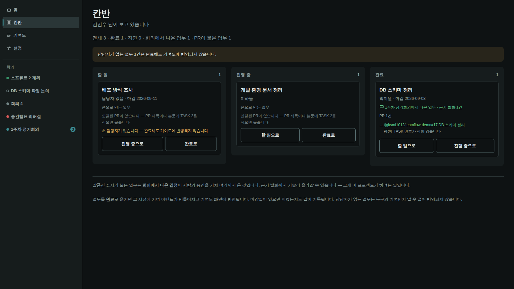

다섯 줄이 다섯 상태입니다 — 초록(열림) · 속 빈 점(처리 중) · 회색(끝남) ·
빨강(실패) · 청록에 개수(검토 필요). 어느 방에 들어갈 수 있고 어디에 내
할 일이 남았는지가 **글을 읽기 전에** 보입니다.

### 상태는 다섯인데 색은 셋입니다

색을 상태 수만큼 만들면 사람이 그 표를 외워야 합니다. 그래서 셋만 만들고
넷째는 **모양**으로 갈랐습니다 — `처리 중` 은 속이 빈 점입니다. "아직 안
찼다" 를 색이 아니라 형태가 말합니다.

`--ok`·`--bad` 를 **쓸 수 없었습니다.** 그 둘은 다크에서 뒤집히는데 껍데기는
안 뒤집힙니다 (§4). 밝은 모드 값을 껍데기 위에 얹으면 1.4:1 · 1.9:1 로 그냥
안 보입니다. 그래서 색조(152°·0°)만 빌리고 명도는 `scripts/derive_chrome_ramp.py`
로 다시 찾았습니다 — 기준면 4.50:1 · 4.51:1, 선택된 줄 위에서도 3.26:1 · 3.27:1.

개수 알약의 글자색은 **새로 만들지 않았습니다.** 따로 뽑았더니 `#161c1d` 가
나왔는데 `--chrome-side`(#161c1c) 와 파랑 한 칸 차이였습니다. 대비는 대칭이라
기준면을 그대로 쓰면 같은 4.51:1 입니다.

### 회의 안에 들어가도 나머지가 살아 있습니다

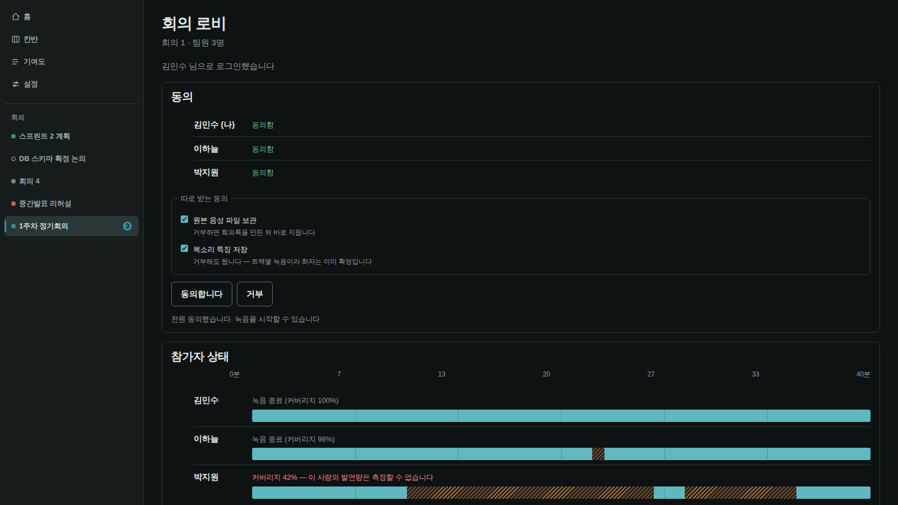

로비는 주소에 `?meeting=` 만 있어서 **칸반·기여도·설정 셋이 흐렸습니다.**
셸이 서기 전에는 화면 아래 탭바에서만 보이던 것이라 잘 안 드러났는데, 열이
늘 떠 있게 되자 바로 눈에 띄었습니다 — 채널 링크에는 전부 `project=1` 이
붙어 있는데 그 바로 위 탭 셋은 "프로젝트를 고르면 열립니다" 라고 말합니다.
**같은 화면이 같은 것을 두고 서로 다른 말을 하고 있었습니다.**

채널 목록을 채우려면 어차피 그 회의의 프로젝트를 알아내야 하므로, 알아낸
값으로 **탭을 다시 그립니다.**

⚠️ 그리고 이건 **폰에서도** 합니다. 처음엔 너비를 먼저 보고 좁으면 통째로
돌아갔는데, 그러면 폰의 로비에서 탭 셋이 흐린 채로 남습니다 — 주소창도
뒤로가기도 없는 PWA 에서 그건 갇히는 길입니다. 390px 로비를 열어 보고
알았습니다. 지금은 이렇게 갈라져 있습니다.

    프로젝트 확정   탭 넷의 절반이 여기 달렸다   → 어느 폭에서나
    회의 목록       셸이 설 때만 보인다          → 넓을 때만 (요청도 안 나감)

### 렌더해서 보고 고친 것

**긴 목록에서 머리말이 밀려 올라갔습니다.** 34개를 넣고 굴려 봤더니 "회의"
라벨이 사라지고 남은 줄들이 위쪽 탭 넷에 그대로 이어 붙어 한 덩어리로
읽혔습니다. 붙여 뒀습니다(`position: sticky`).

**붙여 놨더니 줄들이 머리말 *위로* 지나갔습니다.** `.chan` 에 준
`padding-top: 12px` 때문에 붙은 머리말이 그 여백 **아래**에 서 있었습니다.
여백을 머리말 자신의 `padding` 으로 옮겼습니다 — 그래야 바탕이 같이 덮습니다.

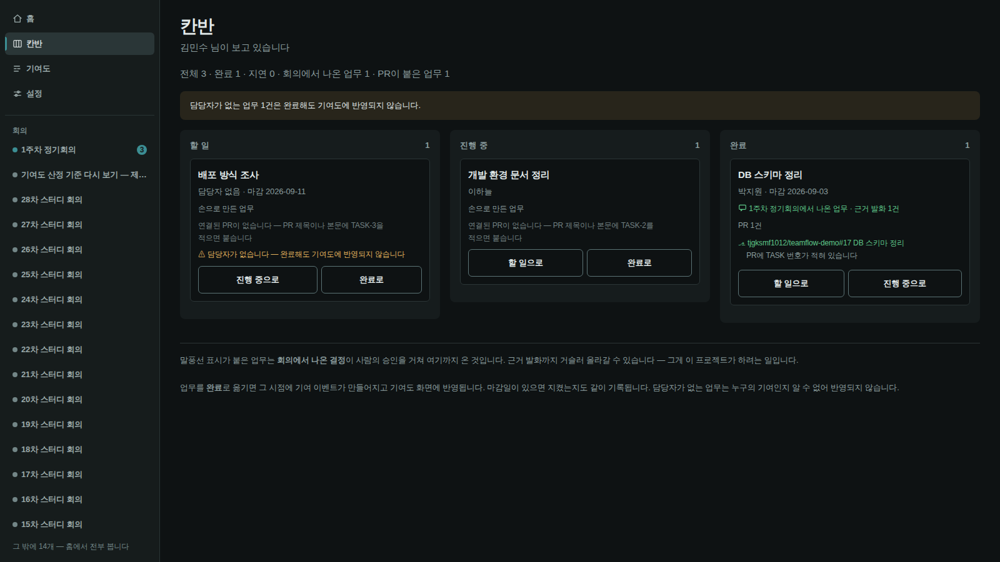

**목록을 자르는 이유를 틀리게 적었습니다.** 처음에 "스크롤이 생기면 탭 넷이
밀려 올라간다" 라고 썼는데, 그건 CSS 로 이미 막혀 있었습니다(탭은
`flex-shrink: 0`, 목록만 스크롤). 34개를 굴려 보고 **내 이유가 틀렸다는 것을**
알았습니다. 진짜 이유는 사이드바가 훑어 찾는 곳이 아니라는 것입니다 —
거르는 수단도 검색도 없는 목록에서 백 줄을 굴리는 것은 목록이 아니라 벽이고,
최근 것부터 주므로 위 스물이면 지금 볼 것은 다 들어옵니다. 전부 봐야 할 때
가는 곳은 홈이고, **거기는 자르지 않습니다**(`home.ts` 의 `projectHtml` 이
받은 것을 전부 그립니다 — 확인했습니다).

**시연 데이터에 회의가 하나뿐이었습니다.** 그러면 채널 목록이 한 줄이라 이
개편이 화면에서 안 보입니다. `seed_demo.py` 가 껍데기 회의 넷을 더 만듭니다
— 알맹이(발화·후보·트랙)는 넣지 않습니다. 흉내까지 내면 시연에서 어느 것이
진짜 파이프라인을 거친 것인지 아무도 모르게 됩니다. 제목 없는 회의를 일부러
하나 두어 `회의 4` 로 불리는 자리가 실제로 그려지는지 봅니다.

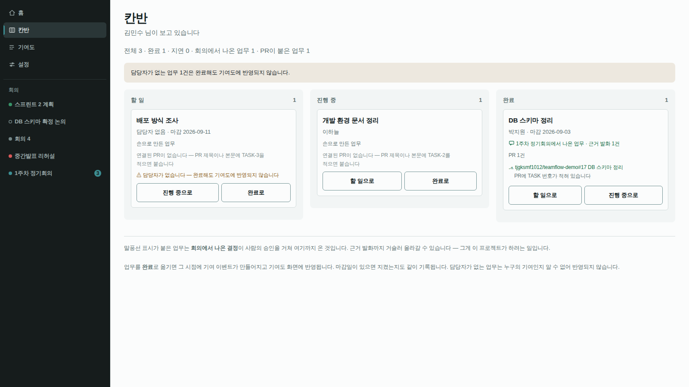

### 붙인 가드

| 무엇을 | 왜 |
| --- | --- |
| CSS 와 JS 의 셸 너비가 같은가 | 갈라지면 그 사이 폭에서 **목록이 보이는데 영영 빕니다** (요청이 안 나가므로) |
| 셸 크롬에 `<ul><li>` 가 없는가 | `lobby.html`·`index.html` 이 `ul` 에 자기 규칙을 걸어 뒀습니다 |
| 응답 **전에** 빈 문구를 안 그리는가 | 회의가 있는 사람이 0.2초 동안 "없습니다" 를 봅니다 |
| 셸 안에서 본문 토큰을 안 쓰는가 | 뒤집히는 색이라 **밝은 모드에서만** 글자가 사라집니다 (v4 가 그랬습니다) |
| 프로젝트를 알아내면 탭을 다시 그리는가 | 그리고 그것이 너비 검사보다 **앞**인가 (폰이 갇힙니다) |
| 채널 점이 두 바탕 위에서 다 보이는가 | 기준면만 재면 **선택된 회의의 점만** 안 보입니다 |
| 알약 글자가 강조색 위에서 읽히는가 | 이 쌍만 `--토큰: 값; /* 주장 */` 모양이 아니라 주석 검사가 못 봅니다 |

일곱 줄 모두 일부러 어겨 보고 잡히는 것을 확인했습니다. **어긴 것이
안 잡히는 가드는 있으나 마나입니다** — 이 저장소에서 "0건" 이 도구가 눈을
감고 있어서 나온 적이 여러 번입니다.

⚠️ 대비 주석 검사도 고쳤습니다. 선언 하나에 주장이 **둘 이상**이면
(`기준면 4.50:1` 과 `선택줄 3.26:1`) 둘째는 아예 안 걸렸습니다 — 안 걸린
주장은 틀려도 통과합니다. 이 파일이 막으려던 모양이 검사 안에 있었습니다.

## 13. 열 머리말 — 지금 어느 프로젝트인가

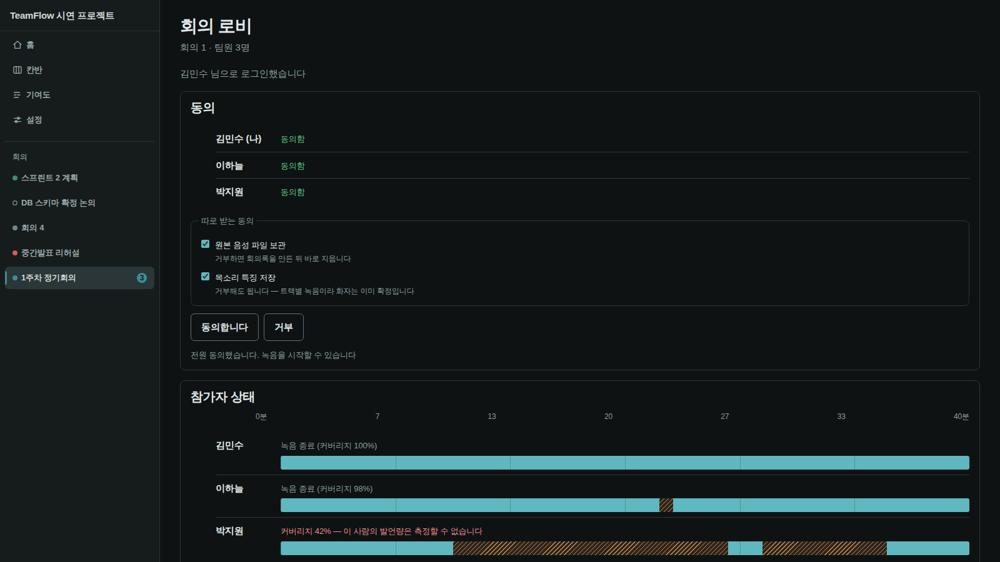

**프로젝트 이름을 말하는 화면이 `project.html` 하나뿐이었습니다.** 칸반은
제목이 "칸반" 이고, 기여도는 "기여도" 이고, 로비는 "회의 로비" 입니다.
어느 프로젝트의 것인지는 주소의 `?project=3` 에만 있어서, 프로젝트가 둘
이상인 사람은 **자기가 어느 팀 화면을 보고 있는지 알 방법이 없었습니다.**

슬랙의 작업공간 이름이 늘 왼쪽 위에 있는 그 자리입니다.

**누를 수 있게 만들지 않았습니다.** 설정으로 가는 길은 탭에 이미 있고,
여기를 또 링크로 두면 같은 곳으로 가는 길이 둘이 됩니다. 이 자리가 하는
일은 **이름을 말하는 것** 하나입니다.

**이름을 모를 때 비워 두지 않습니다.** 홈에는 프로젝트 맥락이 없는데,
비우면 열이 화면마다 다른 높이에서 시작합니다. 프로젝트 위의 이름은
제품 이름(`TeamFlow`)입니다.

⚠️ 이름을 받아 오는 곳은 `GET /api/projects`(목록)입니다. `GET
/api/projects/{id}` 를 쓰면 `ProjectDetail` 이라 **초대 코드**가 딸려
옵니다("초대 코드는 구성원에게만"). 이름 하나 때문에 그것을 칸반·기여도·
로비·검토 네 화면 메모리로 끌고 들어갈 이유가 없습니다.

### 렌더해서 보고 고친 것 — 빈 자리가 **두 번째**

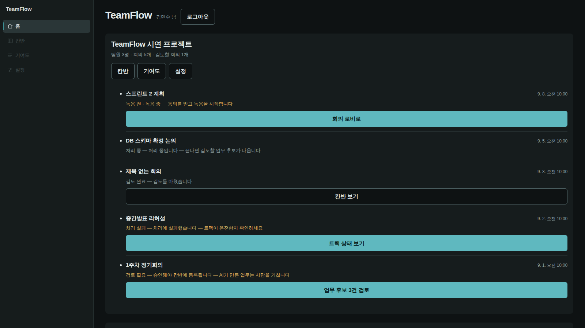

홈을 열었더니 탭 넷 아래에 **아무것도 없는 가로줄 하나**가 남아 있었습니다.
홈에는 프로젝트 맥락이 없어 회의를 못 받아 오는데, `.chan` 의 `border-top`
은 그대로 그려진 것입니다.

**레일 자리를 72px 미리 비워 뒀던 것(§11)과 같은 부류입니다.** 없는 것을
위해 자리를 잡아 두면 그건 빈칸이 아니라 결함입니다. 두 번 당했으니
가드를 붙였습니다 — `.chan` 이 선을 그으면 `.chan:empty` 도 있어야 합니다.

덤으로 이 규칙이 "받기 전에는 아무 말도 하지 않는다" 를 CSS 쪽에서도
지켜 줍니다.

### 바닥 상태 바는 **안 만들었습니다**

§10 의 계획에는 있었지만, 무엇을 담을지 따져 보니 담을 것이 없었습니다.
슬랙의 바닥 바가 하는 일은 "누구로 로그인했는가" 인데 **화면마다 이미
`김민수 님이 보고 있습니다` 가 본문 위에 있습니다.** 같은 것을 한 번 더
그리면 두 벌이 되고, 이 저장소에서 두 벌은 늘 한쪽만 고쳐집니다.

담을 것이 생기면 그때 만듭니다. **최대 위험은 범위 과다입니다.**

## 14. 맥락 패널 — 셋째 열

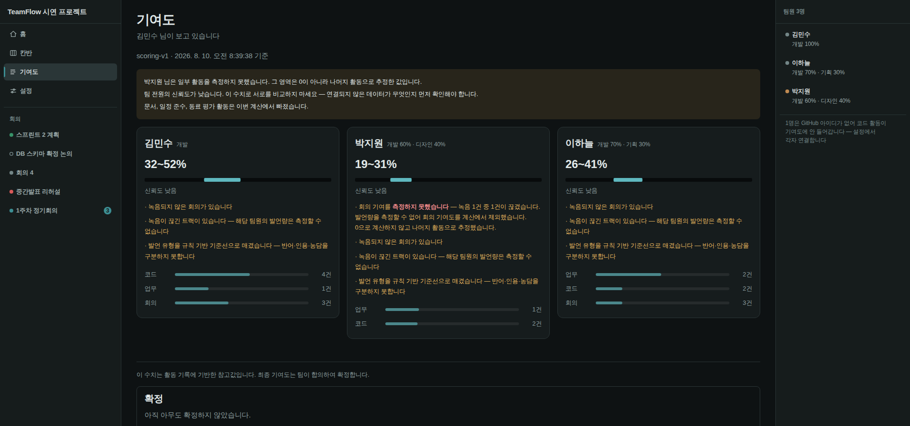

### 계획은 넷이었는데 **하나로 줄였습니다**

§7 은 팀원 · 답이 안 난 것 · 다음 안건 · 동의 넷을 적어 뒀습니다. 붙이기
전에 **실제 화면이 이미 무엇을 말하고 있는지 세어 봤습니다.**

| 담으려던 것 | 이미 있는 곳 |
|---|---|
| 동의 | 로비 본문 — `동의` 카드 |
| 답이 안 난 것 | 검토 본문 — `회의에서 답이 안 난 것` |
| 다음 안건 | 검토 본문 — `다음 회의에서 다룰 안건` |

셋 다 **회의 단위**라, 뜻이 있는 화면에는 이미 본문에 있습니다. 옆에 한 벌
더 그리면 이 저장소가 반복해서 당한 그것이 됩니다 — **두 벌이 있으면
한쪽만 고쳐집니다.**

프로젝트 전체로 모으면 뜻이 달라집니다("이 팀이 아직 답 못 낸 것들"). 그건
좋은 화면이지만 **그걸 주는 엔드포인트가 0개**입니다. 없는 것을 위해 자리를
비워 두지 않습니다 — 생기면 그때 넣습니다.

### 팀원은 왜 남았는가 — **여기만 있는 정보입니다**

팀원 명단을 그리는 화면이 셋인데 셋 다 다른 것을 말합니다.

    로비    지금 이 회의의 녹음 커버리지
    기여도  구간 · 신뢰도 · 근거
    설정    **내 것만** — 남의 역할도 남의 GitHub 연결도 안 보입니다

그래서 **"우리 팀이 각자 뭘 맡았고, 누구 활동을 아직 못 재는가"** 는 지금
어느 화면에도 없었습니다. 그게 이 패널의 몫입니다.

⚠️ 겹치는 데가 한 군데 있습니다 — **기여도 화면은 이름 옆에 역할을 이미
씁니다.** 그대로 뒀습니다. 화면마다 패널 내용이 달라지면 사람이 그 규칙을
따로 외워야 하고, 그건 겹침보다 나쁩니다.

### 점은 둘뿐입니다 — 잰다 / 못 잰다

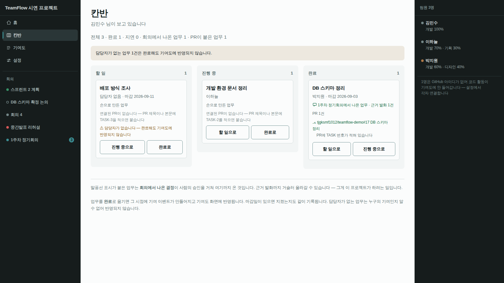

**`나쁨` 이라는 값이 아예 없습니다.** GitHub 아이디를 연결 안 한 사람은
0점이 아니라 **측정 불가**입니다 — 그 사람이 일을 안 한 게 아니라 우리가
못 재는 것입니다(docs/05 §5).

- 잴 수 있는 쪽은 **초록이 아닙니다.** 채널 목록에서 초록은 이미 "회의가
  열려 있다" 입니다. 같은 색에 뜻을 둘 주면 둘 다 헷갈립니다. 그리고 잴 수
  있는 것은 **보통 상태**이지 칭찬할 일이 아니라, 조용한 회색으로 두면
  흙빛이 그만큼 눈에 띕니다
- 못 재는 쪽은 **흙빛**(`--gap`)입니다. 빨강이 아닙니다
- 아래 한 줄은 **몇 명인지만** 말하고 **이름을 나열하지 않습니다.**
  "이하늘·박지원은 못 잽니다" 는 사실상 명단이고, 그 명단은 곧 누가
  부족한지의 목록으로 읽힙니다

⚠️ `--gap` 은 다크에서 뒤집히는데도 껍데기에 씁니다. 예외로 둔 이유는
**두 값 다 껍데기 위에서 읽히기 때문**입니다(4.54:1 · 5.75:1). 셸 토큰
가드에 그 근거를 적어 두었습니다 — 근거 없는 면제는 다음 사람이 그냥
늘립니다.

⚠️ **팀원 순서를 바꾸지 않습니다.** 서버가 가입 순으로 줍니다. 이름순이든
역할순이든 여기서 다시 세우면 그건 목록이 아니라 **순위**로 읽힙니다.

### 100rem 부터 섭니다 — 90rem 이 아니라

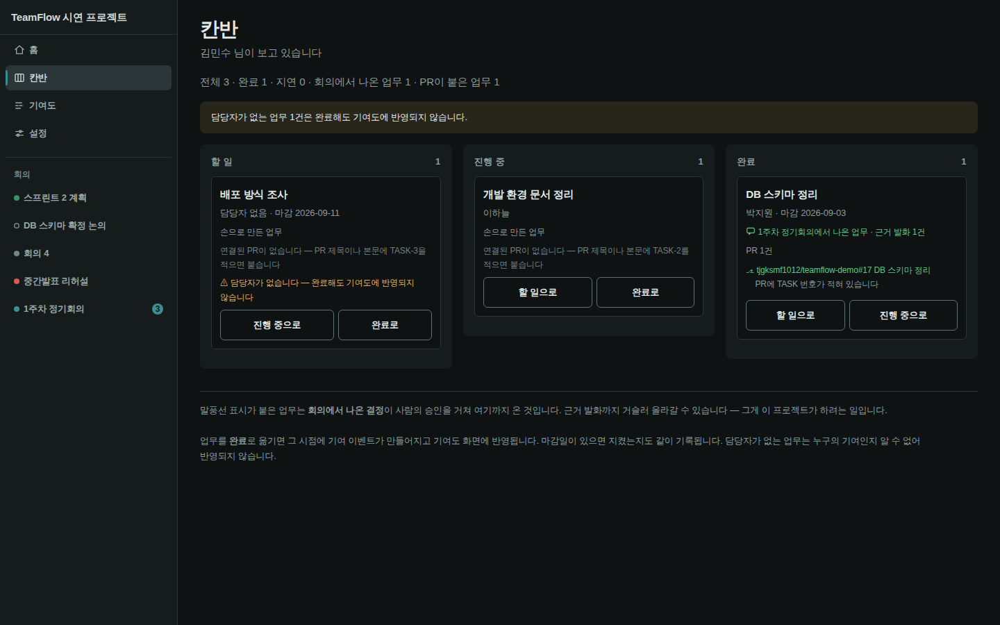

90rem(1440px)에서 셋째 열까지 세우면 본문에 **836px** 만 남고, 칸반은
거기서 열 셋을 나눠 씁니다 — 한 열이 270px 입니다. 카드 안에 "연결된 PR이
없습니다 — PR 제목이나 본문에 TASK-3을 적으면 붙습니다" 같은 문장이
들어가는 화면이라 그 폭에서는 글이 뭉갭니다.

그래서 90~100rem 사이는 **두 열**입니다. 접히는 것이 아니라 원래
모양입니다 — **이 셸에는 접히는 자리가 없습니다.**

### 렌더해서 보고 고친 것

**두 열의 첫 줄이 서로 다른 높이에서 시작했습니다.** 왼쪽에는 50px 머리말
띠가 있는데 오른쪽은 바로 작은 라벨로 시작해서, 셸이 한 벌로 안 읽혔습니다.
패널 머리말도 같은 높이·같은 선으로 맞췄습니다.

**흙빛 점을 한 번도 못 봤습니다.** 시연 데이터는 셋 다 GitHub 이 연결돼
있어서, 렌더해도 전부 회색 점만 나옵니다 — **"됐다" 를 확인한 게 아니라
그 경우가 안 나왔을 뿐**입니다. 한 명의 `github_login` 을 손으로 지우고
다시 그려서 흙빛과 아래 한 줄을 눈으로 본 뒤 되돌렸습니다.
(시연 데이터는 그대로 셋 다 연결된 상태입니다.)

### 붙인 가드 — 그리고 **가드 둘이 눈을 감고 있었습니다**

셸 열이 둘이 되면서 기존 가드 둘이 새 열을 그냥 지나쳤습니다.

| 가드 | 어떻게 눈을 감았나 |
|---|---|
| 셸 너비가 CSS·JS 에서 같은가 | **첫 번째 숫자끼리** 비교하고 있었습니다. 너비가 둘이 되자 뒤엣것은 안 봤습니다 → 두 파일의 **너비 집합**을 통째로 맞춥니다 |
| 빈 구역이 선을 긋지 않는가 | `.chan` 만 봤습니다. `.ctx:empty` 를 지워도 **조용히 통과**했습니다 — 284px 짜리 빈 열이 생기는데도요 → 셸이 세우는 열을 전부 봅니다 |

둘 다 **일부러 지워 보고** 알았습니다. 이 저장소에서 세 번째로 반복된
모양입니다 — 규칙이 아니라 **찾는 방법이 부러져서** 조용히 통과합니다.

## 15. 프로젝트 레일 — **한 번 지웠던 자리를 되찾았습니다**

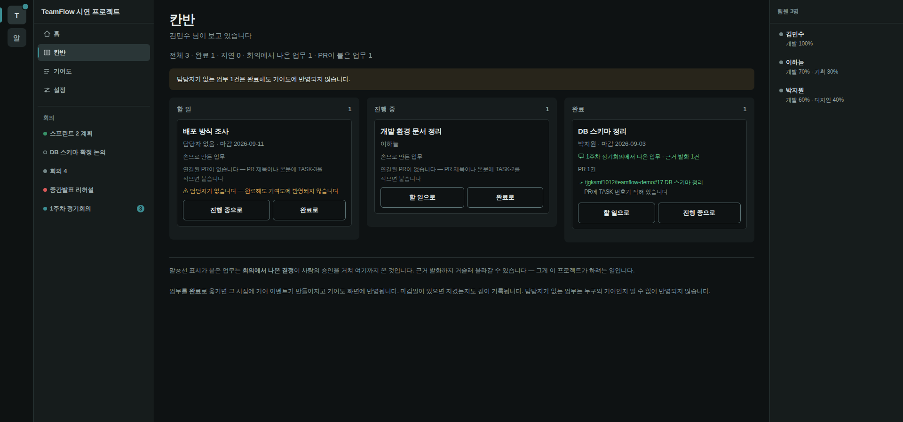

§11 에서 이 72px 을 비워 뒀다가 통째로 걷어냈습니다. 그때 적어 둔 말이
이것입니다 — *"없는 것을 위해 자리를 비워 두면 그건 빈칸이 아니라
결함입니다. **생길 때 더합니다.**"* 이제 생겼습니다.

### 프로젝트가 하나면 레일이 **없습니다**

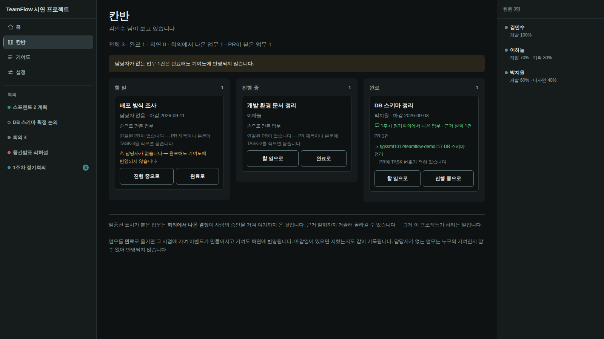

하나뿐이면 **갈 곳이 없습니다.** 누를 것이 자기 자신 하나인 72px 열은
그때 걷어낸 그 빈칸과 같은 것이고, 지금 어느 프로젝트인지는 채널 목록
머리말이 이미 말합니다(§13).

자리를 잡는 것도 **설 때만** 합니다. `nav.ts` 가 프로젝트 수를 보고
`body.has-rail` 을 붙이고, CSS 는 그 클래스가 있을 때만 왼쪽을 밀어
줍니다 — CSS 는 프로젝트가 몇 개인지 모릅니다. 클래스가 없으면 채널
목록이 `left: 0` 에 그대로 붙습니다.

    프로젝트 1개   레일 없음 · #tabs left=0   · body padding-left 288px
    프로젝트 2개   레일 72px · #tabs left=72  · body padding-left 360px

둘 다 실측했습니다.

### ⚠️ 홈과 순서를 **일부러 다르게** 했습니다

홈은 `orderProjects` 로 **할 일 있는 것을 위로** 올립니다. "무엇을 먼저
볼까" 에 답하는 화면이라 맞습니다.

레일은 다른 질문에 답합니다 — **"어디를 눌러야 하나."** 여기서 순서가
흔들리면 검토거리 하나가 생겼다는 이유로 어제 누르던 자리에 다른
프로젝트가 옵니다. `links.ts` 가 탭 순서를 고정하며 적어 둔 그 이유가
그대로입니다 — **사람은 자리를 기억해서 누릅니다.**

그래서 자리는 `project_id` 로 고정하고, 할 일이 있다는 사실은 **자리가
아니라 점**으로 말합니다. 두 순서가 정말 다른 답을 내는지 테스트로
고정해 뒀습니다 — 어느 날 레일이 홈을 따라가면 사람이 누르던 자리를
잃습니다.

**점은 개수가 아니라 있다/없다입니다.** 72px 안에 숫자를 넣으면 글자가
4px 이 됩니다. 개수는 홈과 채널 목록이 말합니다.

### 프로젝트를 바꾸면 셸 전체가 따라옵니다

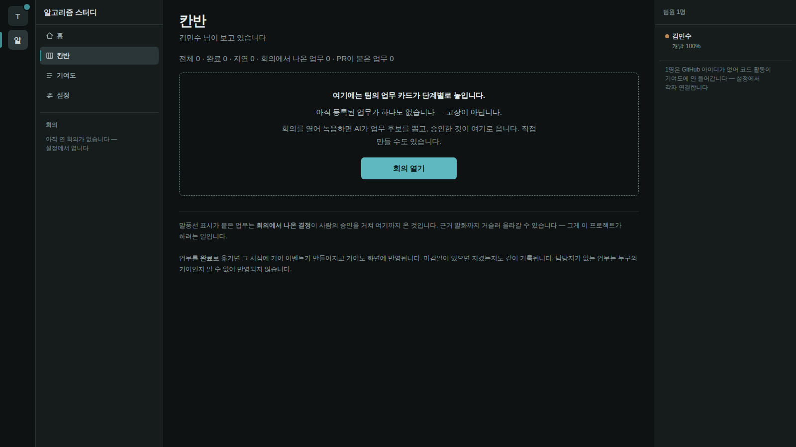

눌러서 실제로 옮겨 봤습니다 — 주소·열 머리말·레일 현재 표시·회의 채널·
맥락 패널이 한 번에 바뀝니다. 새로 만든 프로젝트라 회의가 없어서 채널
자리에는 "아직 연 회의가 없습니다 — 설정에서 엽니다" 가, 본문에는 칸반의
빈 상태가 뜹니다. **빈 화면이 아니라 다음에 할 일을 말하는 화면**입니다.

회의 화면(로비·검토·녹음)에서 프로젝트를 바꾸면 그 프로젝트의 **칸반**
으로 갑니다. 회의는 프로젝트에 딸려 있어 그 화면을 그대로 열 수 없고,
홈으로 보내면 방금 고른 것이 어디로 갔는지 알 수 없습니다.

### 렌더해서 보고 고친 것

**현재 표시 막대가 거의 안 보였습니다.** 탭·채널과 똑같이 `left: -12px`
에 3px 막대를 뒀는데, 레일은 네모가 72px 안에 **가운데** 놓이는 자리라
막대가 열 가장자리에서 4px 쯤 떠서 어두운 바탕에 묻혔습니다. 탭·채널
에서는 막대가 열 맨 왼쪽 끝에 붙기 때문에 같은 값이 통했던 것입니다.
열 끝에 붙이고 더 길게 했습니다 — 색과 굵기의 뜻은 그대로라 "여기가
지금 위치" 를 다시 배울 필요는 없습니다.

### ⚠️ 시연 데이터로는 레일이 안 보입니다

`seed_demo.py` 는 프로젝트를 **하나** 만듭니다. 그래서 시연을 그대로
띄우면 레일이 안 뜹니다 — 규칙대로입니다.

시연 데이터에 프로젝트를 하나 더 넣지 **않았습니다.** 시연이 보여 주려는
것은 회의 → 업무 → 기여도 한 줄기인데, 빈 프로젝트를 옆에 놓으면 그
줄기가 흐려집니다. 레일을 보려면 **홈에서 프로젝트를 하나 더 만드세요**
— 만드는 순간 레일이 생깁니다. 위 캡처는 그렇게 만들어 찍은 것입니다.

### 붙인 가드

| 무엇을 | 왜 |
|---|---|
| `--shell-rail` 을 쓰는 `body` 규칙이 `.has-rail` 뿐인가 | 아니면 프로젝트가 하나인 사람에게 **빈 72px** 이 생깁니다 — §11 로 되돌아갑니다 |
| `has-rail` 을 붙이는 **코드가 있는가**, 그리고 **떼는 코드도** 있는가 | 붙이기만 하면 프로젝트를 나간 뒤에도 72px 이 남습니다 |
| `.rail:empty` 도 접히는가 | 세 열이 같은 규칙이어야 다음 사람이 "이 열만 왜 다르지" 를 묻지 않습니다 |
| 레일 순서가 홈과 다른가 | 같아지는 날 사람이 누르던 자리를 잃습니다 |

앞의 셋은 일부러 어겨 보고 잡히는 것을 확인했습니다.

## 16. 진부함의 정체 — 선언해 놓고 안 지킨 방향

"디자인이 진부하다" 는 지적을 받고 유행부터 찾아봤습니다(벤토 그리드 ·
키네틱 타이포 · 고대비 세리프). **거의 전부 장식이었고**, 외부 폰트를 못
쓰는 이 저장소에는 맞지도 않습니다.

⚠️ **다른 사이트를 눈으로 볼 수는 없었습니다.** 프록시가 모든 외부 호스트의
CONNECT 를 403 으로 막습니다(linear·vercel·notion 전부 응답 000). 브라우저도
같은 프록시를 씁니다. 글로 읽는 조사만 가능했고, **그 사실을 적어 둡니다** —
§2 에 적어 둔 한계가 그대로입니다.

그래서 유행 대신 `tokens.css` 맨 위를 다시 읽었습니다.

> 이 제품의 고유 형태는 **시간축 위의 평행 트랙**입니다. (…)
> 근거는 Marey 의 1885년 열차 운행도표입니다 — (…) 그리고 **빈 곳이 정보**.

**방향은 이미 적혀 있었고, 화면이 그걸 한 번도 살지 않았습니다.** 운행도표는
로비의 패널 하나 안에 위젯으로 들어가 있고 나머지는 전부 회색 카드였습니다.
진부함의 정체는 유행에 뒤진 것이 아니라 **선언과 화면의 간극**이었습니다.

### 실험판을 셋 그려서 봤습니다

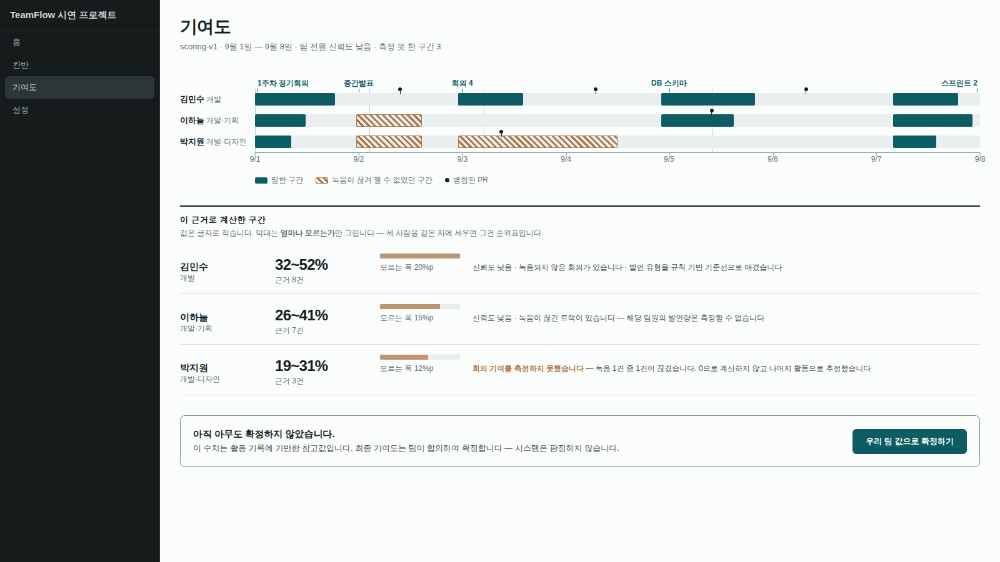

세 판을 렌더해 보며 고친 것:

- **v1 · 회의 이름을 세로쓰기로 세웠다가 못 읽었습니다.** 한글이 트랙과
  겹쳐 "정 의 설" 같은 파편만 남았습니다 → 차트 위에 가로로
- **v1 · 시간축이 거짓말을 했습니다.** 9/3 다음이 9/5 인데 눈금은
  등간격이었습니다. 위치가 시각을 뜻하는 그림에서 이건 치명적입니다 → 선형으로
- **v2 · 제가 불변식을 어겼습니다.** 세 사람 구간을 같은 0~100 축에 세로로
  정렬했더니 그건 막대그래프이고 곧 **순위표**였습니다 → §아래

### 실제로 바꾼 것 — 기여도 화면

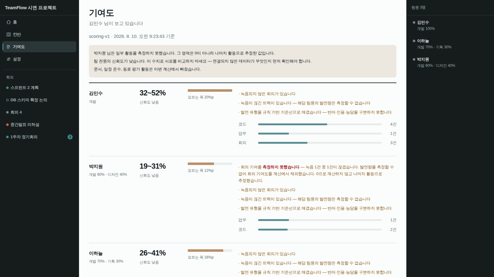

**카드를 걷어냈습니다.** 카드는 "완결된 결과" 처럼 보이는 그릇인데, 여기
있는 것은 범위와 신뢰도와 못 잰 구간입니다. 지금은 제도 도면처럼 규칙선으로만
나눕니다.

**막대가 뜻하는 것을 바꿨습니다.** 예전 막대는 구간의 **절대 위치**를
그렸습니다. 세로 줄로 세우자 세 사람이 같은 자에 정렬됐고 순위표가 됐습니다.
값은 `describeRange` 가 글자로 정확히 말하므로(`32~52%`) 막대는 그 말의
반복일 뿐이었는데, **반복하는 쪽이 순위를 만들었습니다.**

그래서 지금 막대는 **"얼마나 모르는가"** 만 그립니다.

    긴 막대 = 기여가 큰 사람이 아니라 **우리가 가장 모르는 사람**

색도 결측과 같은 흙빛입니다. 이 그림은 팀을 줄 세우는 대신 **다음에 어디를
더 재야 하는지**를 가리킵니다.

### 데이터가 없어서 **안 만든 것**

목업 위쪽의 프로젝트 단위 운행도표는 **짓지 않았습니다.**
`GET /api/projects/{id}/contributions` 는 시간 데이터를 하나도 주지 않고,
시간축 데이터는 `/api/meetings/{id}` 에 **회의 하나 단위로만** 있습니다.

없는 데이터로 그리면 없는 정밀도를 지어내는 것이고, 이 저장소는 그걸
`UnresolvedIssueOut` 에서 이미 금지했습니다 — *"시각을 지어내지 않는다."*
프로젝트 단위 타임라인 엔드포인트가 생기면 그때 그립니다.

### 가드가 잡은 것 둘

| 가드 | 무엇을 잡았나 |
|---|---|
| lib 의 export 를 화면이 부르는가 | `rangeBar` 가 죽은 코드가 됐는데 제가 **"나중에 쓸지도" 라며 주석으로 변명**해 두었습니다. 가드가 맞았습니다 — 지웠고, 그 함수가 알던 것(뒤집힌 구간·범위 밖 값)은 새 함수 테스트로 옮겼습니다 |
| 4px 격자 | `margin-top: 2px` |

그리고 **스켈레톤이 옛 모양으로 남을 뻔했습니다.** 화면은 줄로 바뀌었는데
로딩 스켈레톤은 `class="card"` 였습니다 — 카드가 잠깐 떴다가 줄로 튀는,
그 파일이 막으려던 바로 그 모양입니다. 같이 고치고 검사도 새 모양으로
바꿨습니다.

⚠️ **폰에서 가로로 222px 넘쳤습니다.** 네 칸 격자를 390px 에 밀어 넣은
것입니다. 렌더해서 실측하고 좁은 화면은 한 칸씩 쌓도록 고쳤습니다 —
이 저장소는 가로 넘침 0 을 지켜 왔습니다.

## 17. 칸반 — 같은 어휘로, **은유는 그대로**

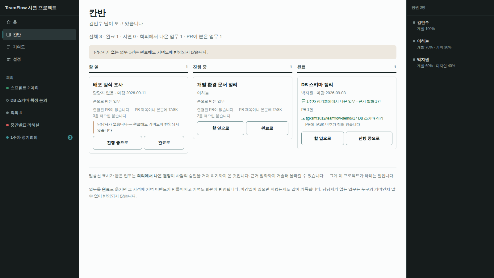

기여도를 규칙선으로 바꾸고 나니 한 제품 안에 판형이 **두 벌**이 됐습니다.
칸반은 회색 둥근 상자 셋이었고, 그건 어느 보드 화면과도 구분되지 않습니다.

**열 상자를 걷어냈습니다.** 열은 이제 머리 규칙선 하나 + 개수입니다.

⚠️ **카드는 남겼습니다.** 기여도에서 카드를 걷어낸 이유는 "완결된 결과처럼
보이는 그릇에 **불확실한 값**을 담았다" 였습니다. 여기 있는 것은 진짜로
옮기는 물건이라 카드가 맞는 은유입니다 — **판형을 맞춘다고 은유까지 갈아
끼우지 않습니다.**

### 노랑 삼각형을 흙빛 막대로

`담당자가 없습니다 — 완료해도 기여도에 반영되지 않습니다` 가 노란 ⚠ 로
떠 있었습니다. 그런데 담당자가 없는 업무는 **잘못된 것이 아니라** 누구
기여인지 알 수 없는 것이고, 이 저장소는 그런 자리를 결측(흙빛)으로
그리기로 정해 뒀습니다. 경고 삼각형은 "네가 뭘 잘못했다" 로 읽힙니다.

왼쪽 흙빛 막대로 바꿨습니다 — 맥락 패널의 측정 불가 점, 기여도의 모르는
폭 막대와 **같은 어휘**입니다.

⚠️ 4px 격자 가드가 제 `padding: 1px` 을 잡았습니다.

## 18. 화면이 인터페이스가 아니라 **교재**였습니다

"텍스트가 너무 많아 가독성이 최악" 이라는 지적을 받고 **세어 봤습니다.**

    칸반 카드 하나        안내문 넉 줄 (그중 둘은 카드마다 똑같은 문장)
    기여도 한 줄          사유 석 줄 × 사람 셋 = **아홉 줄**
    화면 아래             긴 문단 둘~셋
    기여도 정적 글자      517자 · 문장 열

원인을 찾아보니 이 저장소의 문화였습니다. **"말해 줘야 한다"** 를 지키다가
그것을 **영구 인라인 산문**으로 구현한 것입니다. 결과가 이겁니다 —
정직하지만 아무도 안 읽는 화면.

> **정직함은 "항상 보이기" 가 아니라 "언제나 닿을 수 있기" 입니다.**

### 지우지 않고 **접었습니다**

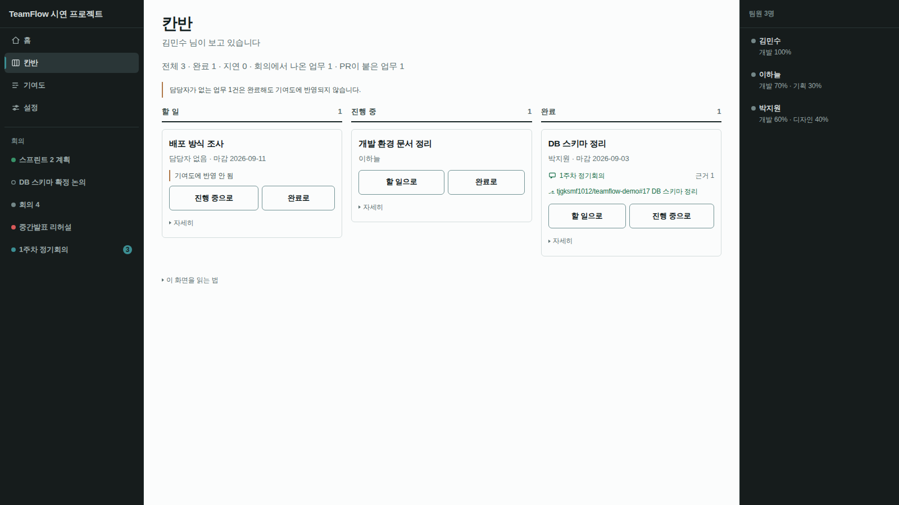

⚠️ `hidden` 이 아니라 `<details>` 입니다. `hidden` 은 낭독기에서도
사라지므로 **지운 것과 같습니다.** `<details>` 는 글이 DOM 에 그대로
남아 낭독기·브라우저 검색·가드가 전부 닿습니다.

가드도 확인했습니다 — 문구를 붙들고 있는 가드는 하나뿐이고
(`board.test.ts` 의 `기여도에 반영되지 않습니다`) 그것도 **lib 함수의
반환값**을 볼 뿐 화면에 보이는지는 안 봅니다. 그래서 **문장을 만들되
접는 것**이 가능했습니다.

### 적용한 규칙 다섯

| 규칙 | 예 |
|---|---|
| **기본값은 말하지 않는다** | "손으로 만든 업무" 를 카드마다 적었는데, 그게 기본값이라 대부분에 붙어 **정작 회의 표시가 안 띄었습니다.** 없는 것이 곧 손으로 만든 것입니다 |
| **카드마다 같은 문장은 카드에서 뺀다** | "PR 제목에 TASK-3을 적으면 붙습니다" 가 안 붙은 카드 전부에 깔렸습니다 |
| **색이 이미 말한 것을 글로 반복하지 않는다** | 링크의 확정/추정은 **색**이 말합니다. 근거 문장은 툴팁과 서랍으로 |
| **상태는 형태로** | 노란 ⚠ "담당자가 없습니다…" → 흙빛 막대 + `기여도에 반영 안 됨` |
| **여럿 중 하나만 보인다** | 기여도 사유는 **맨 앞 하나**만. `readBeforeTheNumber` 가 측정 불가를 맨 앞에 두므로 그 판단을 그대로 씁니다 |

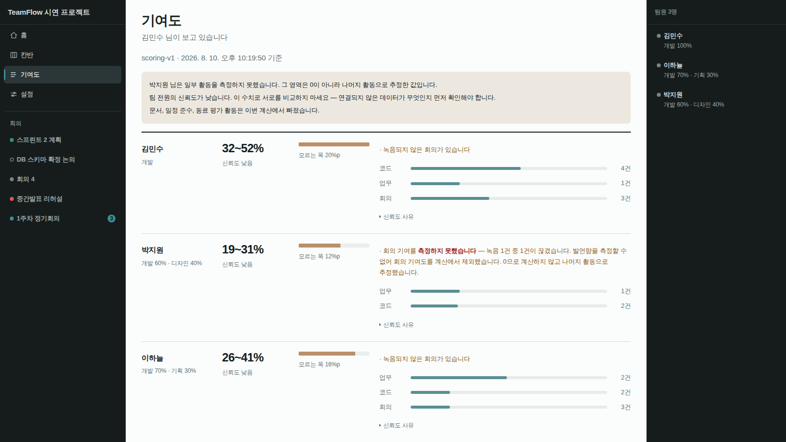

### ⚠️ 안 줄인 것 — 팀 경고

기여도 맨 위의 경고 상자(`이 수치로 서로를 비교하지 마세요`)는 **그대로
뒀습니다.** 여기가 이 제품의 윤리가 사는 자리이고, 눈에 띄어야 하는 곳이
맞습니다. **다 줄이는 것이 목표가 아닙니다** — 줄이려다 정작 중요한
경고까지 접으면 그건 다른 방향의 같은 실수입니다.

### 노란 배너도 흙빛으로

칸반 위의 `담당자가 없는 업무 1건은…` 이 노란 띠였습니다. 카드에 이미
흙빛 표시가 있는데 화면 위에 또 노란 띠를 깔면 같은 말이 두 번이고,
색이 강해서 **보드보다 배너가 먼저** 읽힙니다.

## 19. 밋밋함 — **금욕이 지나쳤습니다**

§16 에서 제도 도면 방향으로 갔는데, 그게 **금욕적으로 지나쳤습니다.**
전 화면이 13~15px 한 대역이고, 면은 전부 단색이고, 그림은 실선 하나였습니다.

조사에서 나온 2026 유행(글래스모피즘·메시 그라디언트)은 그 글 자신이
*"똑똑한 디자이너들은 오히려 걷어내고 있다"* 고 적고 있어서, **장식이 아니라
재료**만 가져왔습니다.

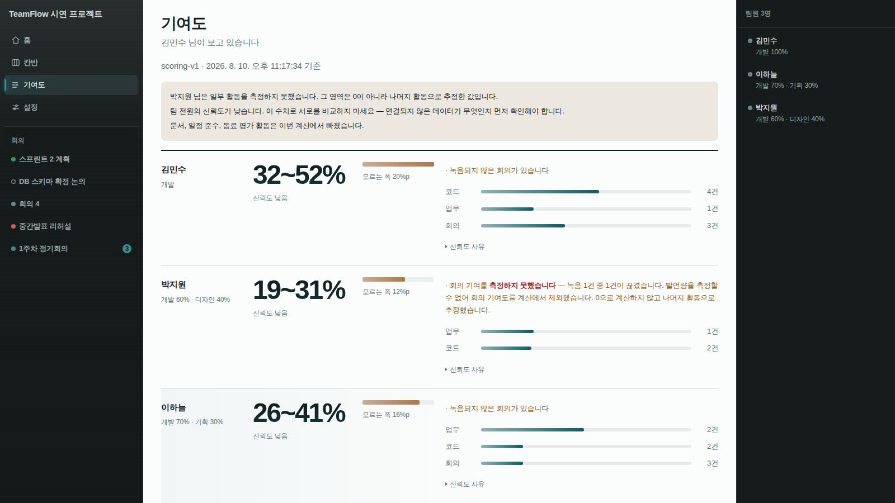

| 재료 | 어떻게 |
|---|---|
| **스케일 대비** | 구간 숫자 24px → **48px**. "구간이 주인공" 이라면서 본문과 한 대역이었습니다 |
| **잉크 농도** | 막대에 그라디언트 — 옅은 데서 짙은 데로. 제도 도면의 잉크가 그렇습니다 |
| **깊이** | 껍데기에 세로 그라디언트 + 3px 주기의 결. 완전 평면인 면은 인쇄물처럼 보입니다 |
| **광원** | 현재 위치 막대에 발광, 그 배경은 막대에서 오른쪽으로 번지는 그라디언트 |
| **반응** | 줄에 마우스를 올리면 잉크가 옅게 번집니다 |

⚠️ **새 hex 는 하나도 만들지 않았습니다.** 전부 기존 계산값의
`color-mix()` 입니다 — `tokens.css` 의 "모든 색은 계산값" 규칙 그대로.

### 그라디언트 글자의 대비를 **픽셀에서 쟀습니다**

숫자에 그라디언트를 씌우면 아래쪽이 어두워져 대비가 위험합니다. 추측하지
않고 브라우저로 렌더한 뒤 **글자 픽셀을 전수 훑어** 최악값을 뽑았습니다.

    다크   12.99:1        라이트  13.54:1

둘 다 4.5:1 을 크게 넘습니다.

### 렌더해서 보고 고친 것

**`32~52%` 가 두 줄로 깨졌습니다.** 48px 글자에 열 폭이 136px 이었습니다 —
목업에서는 13rem 이었는데 실제 화면은 8.5rem 이었습니다. 열을 넓히고
줄바꿈을 막았습니다.

### ⚠️ 문서 두 곳이 거짓이 돼 있었습니다

`tokens.css` 와 `app.css` 가 **"이 저장소는 `box-shadow` 가 0건"** 이라고
적어 뒀는데, 셸을 만들며 제가 그림자를 둘 넣어서 **이미 거짓**이었습니다.

개수를 세는 규칙은 이렇게 낡습니다. 지켜야 하는 것은 개수가 아니라
**쓰임**입니다 — 컨트롤의 경계는 `--line-strong` **선 하나**가 말하고,
거기에 그림자를 얹으면 두 벌이 됩니다. 문장을 그렇게 고치고 가드를
붙였습니다.

⚠️ 그 가드도 **첫 판은 눈을 감고 있었습니다.** 위반을 심었는데 0건이
나와서 확인해 보니, `app.css` 에 `input` 으로 시작하는 규칙이 아예 없어서
**심는 것부터 실패**한 것이었습니다. 실제로 있는 `button, .btn` 에 심으니
잡혔습니다 — 이 저장소에서 여러 번 겪은 그것입니다.

## 20. 홈과 검토 — 같은 원칙으로

### 홈이 **버튼 밭**이었습니다

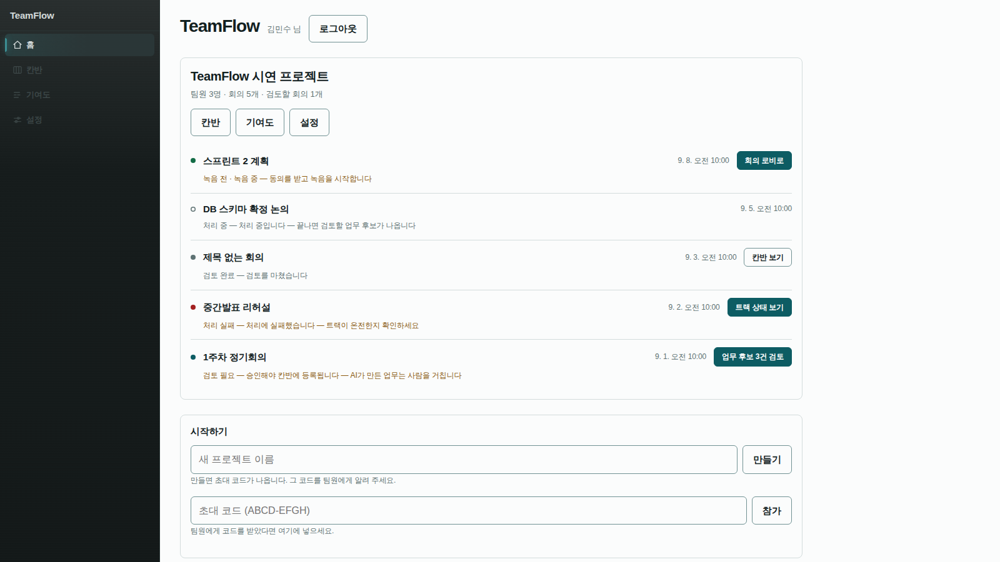

회의마다 `btn-block` 이라 **화면 폭짜리 초록 덩어리가 다섯 개** 깔렸습니다.
화면이 "지금 무엇을 할 차례인가" 가 아니라 버튼을 세는 곳이었습니다.
줄 오른쪽 끝의 작은 버튼이면 충분합니다 — 줄 자체가 이미 어느 회의인지
말하고 있습니다.

**상태 점을 채널 목록과 같은 어휘로** 바꿨습니다. 같은 회의가 왼쪽 열에도
있는데 거기선 점, 홈에선 글자였습니다 — 같은 것을 두 어휘로 그리면 사람은
둘을 따로 배웁니다. 상태 → 점 종류의 판단은 `lib/nav/channels.ts`
**한 곳**에만 둡니다.

### 검토 — 판단 근거가 가장 작았습니다

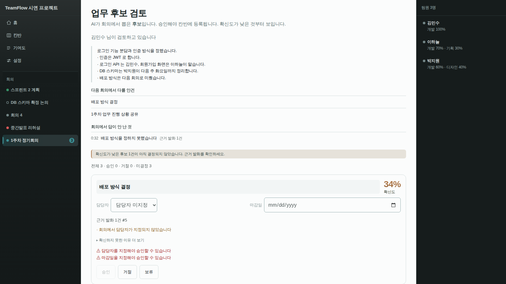

이 화면에서 사람이 하는 일은 **"AI 가 얼마나 확신하는가" 를 보고 승인
여부를 정하는 것**입니다. 그런데 확신도가 **12px 에 `opacity: .7`** 로,
제목보다 작았습니다. 28px 로 올리고 잉크 농도 그라디언트를 씌웠습니다 —
기여도 숫자와 같은 어휘입니다. 확신도가 낮으면 흙빛으로 바뀝니다.

**서버가 확신 못 한 이유는 첫 줄만** 보이고 나머지는 접힙니다. 후보 셋이면
여섯 줄이 되고, 그러면 정작 **지금 고쳐야 하는 것**이 그 사이에 묻힙니다.

⚠️ **`blockers` 는 접지 않았습니다.** 그건 기록이 아니라 **승인을 막는
것**이고, 접으면 사람이 왜 승인 버튼이 죽어 있는지 모릅니다. 접는 기준은
"길어서" 가 아니라 **"지금 행동에 필요한가"** 입니다.

노란·빨간 배너도 칸반과 같이 조용한 왼쪽 막대로 낮췄습니다.

### `.card` 만 회색 덩어리로 남아 있었습니다

칸반 카드·기여도 판독 줄·검토 접기가 전부 헤어라인인데 공용 `.card` 만
채움이라, 한 제품 안에 어휘가 두 벌이었습니다.

⚠️ 그런데 그 채움에는 **근거가 있었습니다** — *"폰에서는 1px 선이 여러 개
겹치면 화면이 빽빽해 보입니다."* 그건 폰에서만 참입니다. 근거를 뒤집지
않고 **적용 범위를 좁혔습니다.**

    폰(< 48rem)    채움 · 테두리 0      ← 원래 근거가 사는 자리
    넓은 화면       투명 · 1px 선

둘 다 실측했습니다 (`rgb(242,245,245)` / `rgba(0,0,0,0)` + 1px).

### 아직 안 한 것

- 로비도 같은 원칙으로
- 프로젝트 단위 "아직 답 못 낸 것" · 프로젝트 단위 운행도표 — 둘 다
  엔드포인트가 생기면

---

## 21. 받은 피드백 — "상용 SaaS처럼 보이게"

26개 절짜리 디자인 브리프를 받았습니다. 요구는 하나로 요약됩니다 —
*"실제 출시 가능한 상용 SaaS처럼."* 참고 방향은 Linear · Attio ·
Superlist · Vercel · Notion Calendar · Raycast 인데, 복제가 아니라
**절제된 색 / 높은 정보 밀도 / 정돈된 여백 / 약한 경계**만 가져오라는
단서가 붙었습니다.

⚠️ 브리프가 순서를 못 박았습니다:
**시각적 위계 → 레이아웃 → 타이포 → 여백 → 컴포넌트 일관성 → 색 → 장식.**
*"Decoration부터 건드리지 말 것."* 그래서 아래도 그 순서입니다.

### 21.1 본문이 화면만큼 넓어졌습니다 (레이아웃)

1920px 에서 셸 열 셋(72+256+284)을 빼도 본문에 **1308px** 이 남습니다.
그 폭을 그대로 쓰니 한 줄이 90자를 넘고, 카드 안이 텅 비고, 왼쪽 제목과
오른쪽 버튼이 550px 떨어져 **한 덩어리로 안 읽혔습니다.**

`--main-max: 68rem`(1088, 글 1024)을 두었습니다. 문제는 **어디에** 거는가
였습니다:

    body 에 padding-left 로 열을 비움  →  본문이 남은 폭을 전부 먹음
    body 에 max-width 를 걸음          →  왼쪽 여백까지 가운데 정렬되어
                                          셸 열 위로 올라탐

그래서 **비우는 일과 모으는 일을 갈랐습니다.** 열 자리는 `html` 이
`padding` 으로 비우고, `body` 는 그 안에서 `margin-inline: auto` 로
모입니다. `body` 배경은 캔버스로 전달되므로 `html` 여백 자리에도 같은
색이 칠해져 이음매가 없습니다.

⚠️ 레일 자리를 비우는 규칙이 `body.has-rail` 에서
`html:has(body.has-rail)` 로 옮겨 갔습니다. **그 규칙을 지키던 가드는
선택자가 `body` 로 시작하는 것만 봤습니다** — 옮기는 순간 아무 말 없이
0건이 됩니다. 검사 범위를 넓히고, **심은 위반을 잡는지**부터 확인하게
했습니다.

### 21.2 좌우가 다 어두워 가운데가 종이 한 장이었습니다

맥락 패널을 왼쪽 열들과 같은 `--chrome-*` 로 칠했더니, 짙은 두 벽 사이에
밝은 본문이 끼는 모양이 됐습니다. 1920px 로 렌더해 보니 **화면의 주인이
본문인데 양쪽 어둠이 시선을 먼저 가져갔습니다.**

가른 기준은 색이 아니라 **역할**입니다:

    왼쪽  이동 (프로젝트·회의를 옮겨 다님)        → 껍데기. 안 뒤집힘
    오른쪽 지금 보는 것에 딸린 정보 (팀원·측정)   → 본문. 같이 뒤집힘

그래서 맥락 패널은 이제 본문 토큰을 씁니다. 가드도 **방향을 뒤집었습니다** —
왼쪽은 본문 토큰 금지, 오른쪽은 껍데기 토큰 금지. ⚠️ 둘 다 "0건" 이라
방향이 바뀐 것을 못 볼 뻔했습니다. 각 열이 **실제로 무엇으로 칠해져
있는지**를 따로 확인합니다.

### 21.3 카드가 파여 보였습니다 — 그리고 어두운 모드를 깨뜨렸습니다

밝은 모드의 표면 사다리가 뒤집혀 있었습니다: 페이지 98.6% > 카드 95.5%.
카드가 떠오르는 게 아니라 **파인 것**처럼 보였습니다. 어두운 모드와
반대였습니다.

    --sunken  ink-100   입력창 안쪽
    --bg      ink-050   페이지 (가라앉은 면)
    --surface ink-000   카드   (떠오른 면)

⚠️ **여기서 `--surface: #ffffff` 라고 직접 적었습니다.** 다크 블록은
Layer 1(`--ink-*`)만 뒤집으므로, Layer 2 에 적은 날 hex 는 **영영 안
뒤집힙니다.** 어두운 화면에 흰 카드가 떠 있고 그 위에 밝은 회색 글자가
얹혀 아무것도 안 보였습니다. 테스트는 전부 통과했습니다 — **렌더해서 보고
알았습니다.** `tokens.css` 맨 위의 *"모든 색은 계산값입니다"* 가 이 자리를
두고 한 말이었습니다.

### 21.4 검토 화면 — 고친 것은 장식이 아니라 순서

|            | 예전                                   | 지금                            |
| ---------- | -------------------------------------- | ------------------------------- |
| 화면 위    | 제목·설명·검토자·요약·안건·미해결 = 넉 줄 넘게 | 제목 + 설명 + 검토자 꼬리표     |
| 회의 맥락  | 전부 펼침                              | 접힌 한 줄 (`회의 요약 · 다음 안건 2 · 답 안 난 것 1`) |
| 개수       | 세기만 하는 한 줄                      | **실제로 거르는** 탭 넷         |
| 확신도     | 48px `34%` — 제목보다 큼               | 제목 옆 12px 알약               |
| 담당자·마감일 | `담당자 [담당자 미지정]` 라벨 + 기본 위젯 | 아이콘 + compact 컨트롤        |
| 막는 이유  | 한 줄에 하나씩 **전부 빨강**           | 한 줄. 안 채운 칸은 흙빛        |
| 버튼       | `승인 / 거절 / 보류` 같은 무게 셋      | 등록(주) · 나중에(보조) · 거절(글자) |
| 경고 배너  | 화면 위 + 카드 안 = 같은 말 두 번      | 제출 막대에서 한 번             |

⚠️ **세기만 하고 거르지 않는 탭은 거짓말입니다.** 그래서 `reviewLane` 과
`laneCounts` 를 lib 에 두고 테스트를 붙였습니다. 그러면서 알게 된 것:
`summarize` 는 **초안만** 보므로 이미 승인된 후보가 `검토 필요` 로
올라옵니다. 탭을 그리는 데 그 숫자를 쓰면 끝난 일이 할 일이 됩니다.

### 21.5 `:empty` 가 빌 수 없는 것을 감췄습니다

렌더해 보니 카드마다 있어야 할 **메모 칸이 없었습니다.**

결함 58 을 고치며 넣은 `.note:empty { display: none }` 이 원인이었습니다.
`<p class="note">` 가 비면 아무것도 없는 가로줄만 남기 때문에 옳은
규칙이었는데, 검토 화면의 메모 칸이 `<input class="note">` 였습니다.
**`<input>` 은 자식을 가질 수 없는 태그라 값이 무엇이든 언제나
`:empty` 입니다.** 그 입력창은 Stage F 이후로 한 번도 화면에 나온 적이
없었습니다.

하필 그 칸이 **"왜 이렇게 결정했는지"** 를 적는 자리입니다 — 기여도에서
*"이유 없는 조정은 근거 없는 점수와 같다"* 고 적어 둔 것과 같은 약속인데,
그 약속을 지킬 입력창이 조용히 사라져 있었습니다.

`p.note:empty` 로 좁히고, `:empty` 규칙이 void 태그를 겨냥하지 않는지
보는 가드를 넣었습니다. 그 가드가 **실제로 이 결함을 잡는지** 되돌려
확인했습니다.

### 21.6 특성도로 한 번 더

`.cand .title { border: transparent }` 를 적었는데 제목이 여전히 회색
입력 상자였습니다. `app.css` 의
`input:not([type='checkbox']):not([type='radio'])` 가 **(0,2,1)** 이고
`.cand .title` 은 **(0,2,0)** 이라 공용 CSS 가 이깁니다. `input.title` 로
맞췄습니다 — 이것도 렌더해서 보고 알았습니다.

### 아직 안 한 것

- 로비·칸반·기여도를 같은 브리프로 한 번 더
- 담당자·마감일의 진짜 popover (지금은 네이티브 위젯을 다시 칠한 것)

### 21.7 자가 검수 — 실제 화면을 보고 대조했습니다

브리프 §26 의 13문항을 1440·1920 으로 렌더해서 확인했습니다.
**흑백으로도 한 번 봤습니다** (`filter: grayscale(1)`) — 색을 빼도
제목 → 컨트롤 → 주 버튼 순서로 읽힙니다.

왼쪽 정렬선은 눈이 아니라 **재서** 확인했습니다. 두 줄뿐입니다:

    336px   제목 · 설명 · 검토자 · 접힘 상자 · 탭 · 카드 (본문 여백)
    357px   상자·카드 **안쪽**의 모든 글 (여백 20px)

⚠️ 그 과정에서 셋을 더 고쳤습니다 — 접힘 상자 안쪽 여백이 카드보다
4px 좁았고, `content: "\2013 "` 의 꼬리 공백이 접혀 `–회의에서…` 로
붙었고, `::after` 에 `display: inline-block` 이 없어 화살표가 영영
안 돌았습니다 (인라인 상자는 변형되지 않습니다).

메모 칸은 **결정한 뒤에만** 나오게 했습니다. 카드마다 빈 입력 상자가
하나씩 있으면 목록이 폼처럼 보이고, 그 칸의 문구가 "왜 **이렇게
결정했는지**" 라 결정 전에는 설명할 것이 없습니다. 없애는 게 아니라
결정하는 순간 같은 자리에 나옵니다.

---

## 22. 나머지 셋도 같은 브리프로 — 칸반 · 기여도 · 로비

검토 화면만 고치고 두면 **한 컴포넌트만 예뻐지고 나머지는 옛 UI 가
남는** 모양이 됩니다. 브리프가 명시적으로 금지한 것이라 셋을 마저 돌았습니다.

### 22.1 머리말은 **한 벌**이어야 합니다

검토 화면에서 만든 `.head`·`.lede`·`.by` 를 칸반에도 쓰려는 순간
두 벌이 될 참이었습니다. `app.css` 로 옮겼습니다 — 머리말은 모든
화면의 첫인상이라 갈라지면 제품이 둘로 보입니다.

아바타 꼬리표를 만드는 코드도 같은 이유로 `lib/ui/byline.ts` 입니다.
화면 넷이 같은 것을 그립니다. ⚠️ 머리글자는 `Array.from` 으로 뗍니다 —
`name[0]` 은 UTF-16 코드 단위 하나라 이모지에서 **반쪽 글자**가 나옵니다.

네 화면이 전부 이 모양이었습니다:

    칸반
    김민수 님이 보고 있습니다        ← 설명문과 같은 크기·같은 색
    전체 3 · 완료 1 · 지연 0 …       ← 또 같은 크기
    [베이지 배너]                    ← 또

### 22.2 칸반 — 버튼 밭과 굵은 규칙선

- **열 머리의 2px 규칙선 셋**을 걷었습니다. 화면을 가로지르며 카드
  테두리와 경쟁했습니다. 여백만으로 세 덩어리로 읽힙니다.
- **옮기기 버튼이 카드 폭을 반씩** 채우고 있었습니다(`flex: 1 1 auto`).
  44px 짜리 상자 둘이 카드에서 제일 큰 것이었습니다. 위계의 근거는
  **방향**입니다 — 앞으로 보내는 것이 주된 행동, 되돌리기는 실수를 무를
  때만. `moveDirection` 을 lib 에 두고 테스트를 붙였습니다.
  ⚠️ 상태 이름으로 판단하지 않습니다. 이름은 서버가 주므로 `done` 을
  글자로 찾으면 그 순간 두 벌이 됩니다 — **배열 순서**로 봅니다.
- `전체 3 · 완료 1` 을 뺐습니다. **바로 아래 열 머리가 이미 세고
  있습니다** — 같은 수를 두 번 적으면 사람은 둘이 다른 것인 줄 알고
  대조합니다. 남긴 셋이 이 화면의 존재 이유입니다: 회의에서 나왔는가,
  PR 로 끝났는가, 늦은 것이 있는가.
- 담당자 없는 업무를 알리던 배너도 걷었습니다 — 그 말은 해당 카드에
  흙빛 표시로 이미 있습니다.
- 회의 유래 칩을 초록에서 **브랜드 청록**으로. 초록은 채널 목록에서
  이미 "회의가 열려 있다" 이고, 여기서 말하려는 것은 성공이 아니라
  **출처**입니다.

### 22.3 기여도 — 걷어낸 배너, 그리고 **남아 있던 순위표**

브리프가 "베이지 전체폭 배너" 를 콕 집었는데 그게 하필 이 화면에서는
**이 제품의 윤리가 사는 자리**였습니다 — *"이 수치로 서로를 비교하지
마세요."* 지워서 될 문장이 아닙니다.

그래서 **문장은 그대로 두고 면만 걷었습니다.** 노란 채움이 화면 맨 위
200px 을 색 덩어리로 만들어서 정작 읽어야 할 판독 줄보다 먼저
읽혔습니다. 지금은 조용한 면 + 왼쪽 흙빛 막대입니다.

⚠️ **그리고 순위표가 하나 남아 있었습니다.**

이 저장소는 기여도 막대에서 절대 위치를 뺄 때 규칙을 적어 뒀습니다 —
**"값은 글자로만 적고, 막대는 구간의 넓이만 그린다."** 세 사람을 같은
0~100 축에 세로로 세우면 그건 순위표니까요.

그런데 **카테고리 막대는 그대로 남아 있었습니다.** `width: team_share%`
짜리 막대가 세 사람 줄에서 **같은 자리·같은 축**에 정렬돼 있었고, 그건
방금 걷어낸 그 막대그래프와 똑같은 그림입니다. 같은 결함이 옆 칸에서
살아남은 것입니다.

막대를 걷고 `4건 · 팀의 56%` 로 **글자로** 적습니다. 숫자는 지우지
않았습니다 — 글자가 더 정확하고(막대는 40% 와 45% 를 구분해 주지
못합니다), 훑을 때 눈이 옆 사람 줄로 미끄러지지 않습니다.

그 밖에: 줄마다 긋던 가로선을 여백으로, 구간 숫자를 48px → 36px
(왼쪽에 숫자 셋이 벽처럼 서서 **이름보다 먼저** 읽혔습니다), 사유 칸
줄 길이를 56ch 로.

### 22.4 로비 — 버튼 일곱이 한 줄에

전부 같은 크기·같은 테두리라, 녹음을 시작하러 온 사람에게
`로그아웃` 이 `녹음 화면으로` 와 같은 무게로 보였습니다. 셋으로 갈랐습니다:

    주 행동   지금 이 회의에서 할 일 (녹음 · 통화 · 검토)
    이동      칸반 · 기여도 — 왼쪽 열과 아래 탭에 **이미 있습니다.**
              지우지 않되(맥락이 실린 링크라) 글자로 낮춥니다
    위험·계정  강제 종료 · 로그아웃. 글자만

⭐ 그리고 **주 행동이 회의 상태를 따라 움직입니다.** 녹음이 끝난
회의에서 `녹음 화면으로` 가 청록으로 남아 있으면, 화면이 가장 크게
가리키는 곳이 **이제 할 일이 아닌 곳**입니다. 청록은 한 번에 하나만
켭니다 (바로 위 `동의합니다` 가 이미 같은 방식으로 움직이고 있었습니다).

⭐ **끊긴 트랙이 빨간 글씨였습니다.** `커버리지 42% — 이 사람의 발언량은
측정할 수 없습니다` 가 빨강이면 "네가 뭘 잘못했다" 로 읽힙니다. 녹음이
끊긴 것은 고장도 잘못도 아니라 **"이 구간은 잴 수 없었다"** 이고,
`docs/05 §5` 가 정한 그대로 흙빛으로 바꿨습니다 — 기여도의 모르는 폭
막대, 칸반의 반영 안 됨 표시와 같은 색입니다.

`fieldset` 의 테두리도 걷었습니다(패널 안 액자 = 카드 안 카드).
⚠️ **태그는 그대로 둡니다** — 체크박스 둘을 묶는 것은 낭독기에게
의미가 있습니다. 보이는 테두리만 없앤 것이지 묶음을 없앤 것이 아닙니다.

### 22.5 렌더해서 보고 고친 것

- `.notes li` 에 `display: flex` 를 걸었더니 **문장이 깨졌습니다.**
  그 줄에는 `<strong>` 이 섞여 있는데 flex 컨테이너 안에서는 강조가
  **별개의 flex 항목**이 되어 앞뒤 글자와 떨어집니다 —
  `회의  측정하지  — 녹음 1건…` 처럼 낱말이 흩어져 나왔습니다.
  인라인 흐름은 인라인으로 두고 마커만 절대 위치로 뺐습니다.
- lede 에 `**추정한 구간**` 이라고 적었습니다. HTML 에는 마크다운이
  없습니다 — 별표가 그대로 화면에 나옵니다. 이 저장소가 실험판 v1 에서
  이미 한 번 밟은 자리라 렌더 전에 잡았습니다.

---

## 23. 남은 셋 — 홈 · 프로젝트(=설정) · 녹음

⚠️ **"프로젝트" 와 "설정" 은 한 화면입니다.** 왼쪽 열의 `설정` 탭이
`project.html` 을 가리킵니다. 그래서 실제로 남아 있던 화면은 셋이고,
그 셋째가 `index.html`(녹음)이었습니다.

### 23.1 홈 — 내비가 **세 벌**이었습니다

프로젝트 카드 안에 `칸반 / 기여도 / 설정` 버튼 셋이 있었습니다. 같은 세
곳이 **왼쪽 열에도, 폰의 아래 탭바에도** 있습니다. 그중 이 셋만 크고
네모나서 화면에서 가장 먼저 읽혔는데, 정작 이 화면의 주인공은 아래
회의 목록입니다.

⚠️ 지우지는 않았습니다. 이 링크에는 **프로젝트가 실려** 있어서 프로젝트가
여럿일 때 "이 프로젝트의 칸반" 으로 갑니다 — 왼쪽 열의 것과 뜻이 조금
다릅니다. 글자로 낮췄습니다.

로그아웃도 제목 옆 네모 버튼이었습니다. 홈에 온 사람이 하려는 일이
로그아웃일 리는 없는데 화면에서 두 번째로 큰 것이었습니다. 로비와 같은
자리·같은 무게(`.act-quiet`)로 옮겼습니다 — 그 컴포넌트도 두 벌이 될
참이라 `app.css` 로 올렸습니다.

회의 줄의 가로선 넷도 걷었습니다.

### 23.2 `ch` 는 한글에서 줄을 너무 일찍 끊습니다

머리말 줄 길이를 `max-width: 64ch` 로 걸어 뒀는데, 홈의 설명이 **한글
30자쯤에서** 끊겼습니다 — 화면에 자리가 한참 남았는데 두 줄이 됐습니다.

`ch` 는 **숫자 `0` 한 글자의 폭**입니다. 라틴 문자 기준이라 한글에서는
실제 글자 폭의 절반쯤으로 세어집니다. 길이는 글자 수가 아니라 **폭**으로
겁니다 — `rem` 으로 바꿨고, 저장소 안의 `ch` 를 전부 걷었습니다.

### 23.3 프로젝트(=설정) — 제목 여섯이 같은 크기

패널이 여섯인데 제목이 전부 `--fs-title`(20) 이라, 위에서 아래로 훑으면
**같은 크기의 제목 여섯**이 줄지어 있었습니다. 페이지 제목(28)과 한
대역이라 계단이 안 생겼습니다. 패널은 절(節)이지 화면이 아니라서 항목
제목 크기(15)로 내렸습니다 — `app.css` 라 로비·기여도도 같이 정리됩니다.

⚠️ **재 보지 않았으면 선택자만 계속 고쳤을 것입니다.** 역할 입력창을
줄이려고 `.roles input` 에 `min-height: 0` 을 걸었는데 45px 그대로였습니다.
특성도를 의심해 `[type="number"]` 를 붙였는데도 45px 이었습니다. 재 보니
`min-height` 는 **이미 0 으로 먹고 있었고**, 높이는 내용에서 나오고
있었습니다 — 글자 16px 에 `body` 에서 물려받은 `line-height: 1.7` 이면
27px, 여백 16 + 테두리 2 = 45px. 원인은 특성도가 아니라 **행간**이었습니다.

연결 진단의 테두리 상자도 걷었습니다(패널 안 액자 = 카드 안 카드).

### 23.4 녹음 — 마커가 둘, 그리고 마지막 베이지 배너

`<ul>` 의 기본 불릿이 살아 있는데 `::before` 로 `· ` 를 또 찍어서
화면에 **`• · 마이크 권한을…`** 이 나왔습니다. 목록 마커를 손으로 그릴
때는 기본 마커를 반드시 꺼야 합니다.

`<dl>` 은 기본 조판이 `dt` 아래에 `dd` 를 한 줄씩 놓습니다. 값 넷이면
여덟 줄이고, 화면 절반이 숫자 넷을 세로로 늘어놓는 데 쓰였습니다.
이름과 값을 한 줄에 묶고 가로로 폈습니다.

⭐ 그리고 **저장소에 남은 마지막 베이지 배너**가 여기 있었습니다.
`app.css` 의 `.banner` — 공용이라 화면별 정리에서 계속 살아남았습니다.
말은 그대로 두고 채움만 걷었습니다. 기본 색도 노랑에서 흙빛으로
바꿨습니다 — 배너 문구는 대부분 "아직 안 한 것" 이지 "잘못한 것" 이
아닙니다. 빨강은 `.banner.bad` 에만 남깁니다.

### 아직 안 한 것

- 담당자·마감일의 진짜 popover (지금은 네이티브 위젯을 다시 칠한 것)
- 통화 화면(`call.html`)은 이번에 안 봤습니다

---

## 24. 스택 이전 — 검토·칸반을 React 로

리서치 자료집의 권고(Tailwind v4 + shadcn/ui + Radix)를 받아, **화면
하나를 끝까지 옮겨 보고** 비용을 재기로 했습니다. 고른 것은 검토
화면입니다 — 상태가 가장 많고(초안·차단·탭 필터·제출), 새로 필요해진
것(근거 원문 대화상자)이 마침 여기에 있었기 때문입니다.

### 24.1 옮기면서 지킨 선

**판단은 하나도 화면으로 넘어오지 않았습니다.** `approvalBlockers`·
`blockerLine`·`reviewLane`·`laneCounts`·`buildReviewPayload` 를 그대로
부릅니다. 화면 코드에는 자동 테스트가 없으므로, 판단이 이리로 새는
만큼이 검증 밖으로 나갑니다.

CSS 클래스 이름도 그대로 뒀습니다. 브리프대로 맞춰 놓은 판형을 스택을
옮기면서 다시 흔들 이유가 없습니다. `emptyHtml`·`failureHtml` 은 문자열을
돌려주는 lib 함수라 `dangerouslySetInnerHTML` 로 꽂습니다 — React 로 다시
쓰면 **두 벌**이 되고, 나머지 화면 넷이 아직 그 함수를 씁니다.

### 24.2 얻은 것 — 근거 원문 (`evidence.tsx`)

오랫동안 이 자리는 `근거 #5` 라고 **적기만** 했습니다. "할 일을 알려
주고 그 일을 할 자리를 안 줌" 의 전형입니다. 이제 누르면 Radix Dialog
가 열리고 그 발화의 원문이 나옵니다. 초점 가둠·Esc·바깥 클릭이 공짜로
따라옵니다 — 직접 짰다면 이 셋 중 하나는 빠뜨렸을 것입니다.

### 24.3 ⚠️ 치른 값 — 가드 다섯이 눈을 감았습니다

옮기고 나서 테스트를 돌리니 다섯이 실패했습니다. **요구는 하나도 안
바뀌었는데** 검사가 명령형 헬퍼의 **이름**을 세고 있었기 때문입니다.

| 가드 | 무엇을 세고 있었나 | React 는 |
|---|---|---|
| 탭바를 채운다 | `${화면}.ts` 를 읽음 | `.tsx` 라 **파일이 없다고 터짐** |
| 진입점 목록 | `/\.ts$/` 로 확장자를 벗김 | `review.tsx.html` 을 찾다 실패 → **조용히 제외** |
| 누르는 동안 잠근다 | `.disabled = true` | `disabled={… \|\| sending}` |
| 로딩 표시를 켠다 | `showSkeleton(` | 깃발 + JSX |
| 끄는 짝이 있다 | `clearSkeleton(` | `whileLoading` 의 `finally` |

앞의 둘은 **측정이 낡은** 것이고, 뒤의 셋은 **모양이 둘인** 것입니다.
그래서 앞의 둘은 확장자를 풀고(`demoSource`·`SCREEN_EXT`), 뒤의 셋은
요구를 모양별로 재도록 갈랐습니다. React 쪽은 이렇게 봅니다:

- 잠금 — `setX(true)` · `setX(false)` · `disabled={… x …}` **셋 다**.
  켜기만 보면 안 푸는 화면이 통과하고, 켜고 끄기만 보면 버튼에 **안
  이어진** 깃발이 통과합니다.
- 로딩 — `whileLoading(` + 스켈레톤 모듈 + `aria-busy`.
- 끄는 짝 — `whileLoading(...)` 의 **인자 안에서** 짝을 봅니다. 파일
  전체를 훑으면 아무 데나 있는 `setX(false)` 가 짝인 척합니다.

### 24.4 그중 하나는 진짜 결함이었습니다

가드 다섯을 "이름만 다른 것" 으로 뭉뚱그렸다면 놓쳤을 것이 있습니다.
첫 React 판은 `k: 'loading'` 이면 **곧바로** `불러오는 중…` 을 그렸습니다.
`whileLoading` 은 부르지 않았습니다.

그래서 화면을 열 때마다 **반드시** 한 번 깜빡였습니다 — 요청 대부분은
200ms 안에 끝나므로, 옮기기 전 화면이 없애려고 만든 바로 그 결함을
**그 함수를 안 부르는 방식으로** 되살린 것입니다.

측정으로 확인했습니다. 빠른 응답에서 `[aria-busy]` 가 뜬 프레임 **0개**,
느린 응답(700ms 지연)에서는 뼈대 세 줄이 뜨고 내용이 오면 걷힙니다.

### 24.5 검사 자신을 검사했습니다

가드를 고친 뒤, 여덟 가지 위반을 **하나씩 심어** 전부 잡히는지 봤습니다.
처음 세 개가 안 잡혔는데, **셋 다 심는 방법이 틀린 것**이었습니다:

- `// renderNav('review');` — 주석 처리로는 못 심습니다. 이 가드들은
  `codeOf` 를 안 거치고 원문을 봅니다. 지워야 합니다.
- `bootApp()` 도 같은 이유.
- 빈/오류 상태 가드는 `emptyHtml(` **또는** `failureHtml(` 입니다.
  한쪽만 지우면 나머지가 자리를 메웁니다 — 그건 가드가 맞습니다.

이 저장소에서 세 번째입니다. **위반을 심는 방법이 틀려 "0건" 이 나오는
것**이 새 검사 도구를 쓸 때마다 나오는 실패 방식입니다.

### 24.6 값은 얼마였나

⚠️ **처음에 "번들이 39KB → 266KB 로 늘었다" 고 적었다가 재 보고
고쳤습니다.** 늘어난 것은 이번이 아닙니다. React 값은 **지난 커밋**에
`evidence.tsx`(근거 대화상자)를 붙일 때 이미 다 치렀고, 그때 `review.ts`
가 그것을 import 하면서 번들이 그 크기가 됐습니다. 이번 이전은 그 위에
1KB 를 더한 것뿐입니다. 잰 값입니다:

| 항목 | 전 | 후 |
|---|---|---|
| `review.js` (min) | 266,631 B | 267,626 B (**+995 B**) |
| 화면 코드 줄 수 | 607 | 683 |
| 고쳐야 했던 가드 | — | 5 |

React 의 진짜 값이 보이는 자리는 여기가 아니라 **화면끼리의 차이**입니다:

| 번들 | 크기 |
|---|---|
| `home.js` (React 아님) | 22,696 B |
| `kanban.js` (React 아님) | 22,849 B |
| `review.js` (React) | 267,626 B |

약 **245KB** 가 React·React DOM·Radix 입니다. 그중 대부분은 react-dom
이고, Radix Dialog 가 화면 하나 때문에 37KB 를 더 얹습니다.

### 24.7 두 번째 화면 — 칸반

검토 화면이 증명한 방식 그대로 옮겼습니다. 판단은 전부 `lib/kanban/board.ts`
에 두고 화면은 그리기만 합니다.

옮기면서 공용으로 올린 것이 둘입니다 — `RawHtml`(빈/오류 상태 문자열을
꽂고 [다시 불러오기] 를 잇는 조각)과 `Byline`. 검토 화면 하나뿐일 때는
그 안에 있었고, **두 번째로 필요해지는 순간** `src/demo/parts.tsx` 로
올렸습니다. 이 저장소가 반복해 당한 "두 벌" 을 만들지 않으려면 그 순간을
놓치면 안 됩니다.

그래서 가드도 하나 넓혔습니다. "[다시 불러오기] 를 만든 화면은 그것을
잇는다" 가 **화면마다 직접 잇는지**를 봤는데, React 화면은 공용 조각에
`onRetry` 를 넘길 뿐입니다. 넘기는 것도 이었다고 보되, **넘겨받는 쪽이
정말 잇는지**를 따로 못 박았습니다.

⚠️ 그 못 박는 검사도 처음엔 헐거웠습니다. `.retry')` 와 `onRetry()` 만
봤더니 **`addEventListener` 줄을 통째로 지워도 통과**했습니다 — 재료는
그대로 있고 잇는 동작만 사라진 것을 못 본 것입니다. 심어 보고 알았습니다.

#### 옮기다 찾은 진짜 결함 — "할 일으로"

렌더해 보니 칸반의 옮기기 버튼에 **"할 일으로"** 가 떠 있었습니다.
`할 일` 은 ㄹ 받침이라 `할 일로` 가 맞습니다.

`lib/text/josa.ts` 가 받침 유무만 보고 `으로/로` 를 골랐는데, 한국어는
받침이 있어도 그 받침이 **ㄹ 이면 `로`** 입니다(`서울로`·`할 일로`).
테스트에는 이렇게 적혀 있었습니다:

> ⚠️ ㄹ 받침은 '로' 를 쓰는 것이 한국어 규칙이지만, 이 함수는 그 예외를
> **일부러 안 넣었습니다** — 지금 화면에 ㄹ 로 끝나는 값이 들어가는
> 자리가 없고, 없는 경우를 위한 규칙은 검증할 수 없습니다.

**그 전제가 틀렸습니다.** 칸반의 업무 상태가 `할 일`·`진행 중`·`완료`
이고, 옮기기 버튼이 거기에 조사를 붙입니다. 없는 경우라고 적어 둔 것이
실은 화면에 있었습니다.

같은 착각이 한 군데 더 있었습니다. `setup.test.ts` 가 GitHub 아이디
`hong7` 에 대해 `"hong7으로"` 를 **정답으로** 고정하고 있었습니다.
`7` 은 "칠" 이고 칠은 ㄹ 받침이라 `hong7로` 가 맞습니다 — 틀린 한국어를
테스트가 지키고 있었던 것입니다. `HTTP 401` 도 "사공일" 이라 같습니다.

숫자·로마자도 **읽었을 때**의 끝소리로 갈립니다 — `1`(일)·`7`(칠)·
`8`(팔) 과 `l`(엘)·`r`(알) 이 ㄹ 입니다.

### 24.8 이제 조각을 나눕니다 (`splitting`)

React 화면이 하나뿐일 때는 켜면 **손해**였습니다 — 나눌 중복이 없는데
파일만 늘었습니다. 그래서 안 켰고, 그 판단을 여기 적어 뒀습니다.

칸반이 오면서 중복이 실제로 생겼고, 다시 재니 이렇습니다:

| | 합계 | review | kanban | home |
|---|---|---|---|---|
| 끄면 | 622KB | 259KB | 212KB | 20KB |
| 켜면 | **336KB** | 55KB | 8KB | 4KB |

절반 이하입니다. 커밋된 실제 값은 **364KB** 이고, 그중 **220KB 가 조각
12개**입니다 — 가장 큰 조각 하나(194KB)가 React·React DOM 이고 화면
전부가 그것을 나눠 씁니다. 화면 하나를 여는 데 받는 양도 줄어듭니다:
두 번째 화면부터는 조각이 이미 캐시에 있습니다.

#### 순서가 있었습니다

조각 이름에는 해시가 붙어 빌드마다 바뀝니다. 그래서 `sw.js` 의 오프라인
목록이 **손으로 적는 것**인 동안에는 켤 수 없었습니다 — 빌드마다 사람이
목록을 고쳐야 하고, 안 고치면 가드가 터집니다.

목록을 빌드가 쓰게 바꾼 것(§24.6 앞)이 먼저였고, 그다음에 이걸 켰습니다.
지금은 조각이 생기면 목록에 **저절로** 들어갑니다.

#### 새로 생긴 실패 방식 하나

이름에 해시가 붙으면 내용이 바뀔 때 옛 파일이 **덮이지 않고 하나 더**
생깁니다. 지우지 않으면 아무도 안 부르는 조각이 쌓이고, 오프라인 목록은
`public/` 을 세므로 그 죽은 조각까지 폰에 내려받게 됩니다. 오류는 어디에도
안 납니다 — 이 저장소가 반복해 당한 모양 그대로입니다.

빌드가 만들기 전에 지웁니다. 그리고 **정말 지워졌는지**를 가드가 봅니다 —
디스크의 조각 중 이번 빌드가 안 만든 것이 있으면 터집니다. 심어서
확인했습니다(죽은 조각 하나를 남기니 잡혔고, `splitting` 을 꺼서 조각이
0개가 되어도 잡혔습니다 — 뒤엣것은 "검사가 눈을 뜨고 있는가" 쪽입니다).

### 24.9 그리고 번들 가드가 반쪽이었습니다

`define` 을 지우면 개발 빌드 가드가 터진다고 적어 뒀는데 **거짓**이었습니다.
네 가지로 빌드해서 쟀습니다:

| 설정 | `review.js` | 개발 빌드 문구 |
|---|---|---|
| 지금 그대로 | 258KB | 없음 → 통과 |
| `define` 만 뺌 | 258KB | 없음 → 통과 |
| `minify` 만 뺌 | **719KB** | 없음 → **통과** |
| 둘 다 뺌 | 1206KB | 있음 → 터짐 |

`minify` 가 켜져 있으면 esbuild 가 `NODE_ENV` 를 알아서 `"production"`
으로 넣습니다. 그래서 `define` 은 지금 아무 일도 안 합니다.

진짜 구멍은 `minify` 였습니다. 끄고 **다시 빌드해 커밋하면** 낡은 번들
가드도 통과하므로, 폰에서 719KB 를 받게 되는 변경이 아무 데서도 안
걸렸습니다. 크기 상한을 숫자로 박는 대신 **압축을 강제해 다시 빌드한
것과 커밋된 것을 견주는** 가드를 넣었습니다. 심어서 확인했습니다 —
`minify: false` 로 다시 빌드해 커밋하니 740KB 가 됐고, 개발 빌드 가드와
낡은 번들 가드는 둘 다 통과했으며 새 가드만 터졌습니다.

---

## 25. 불확실 폭 — 막대에서 **셀 수 있는 점**으로

리서치 자료집이 quantile dotplot 을 권했습니다. 근거는 탄탄합니다 —
불확실성 시각화 연구가 한결같이 말하는 것은 **빈도 표현(frequency
framing)이 연속 표현보다 정확하게 읽힌다**는 것입니다. 사람은 길이를
눈대중하는 것보다 **개수를 세는** 쪽을 훨씬 잘합니다.

### 25.1 그대로 가져오지 않았습니다

원래 형태는 **값 축 위에** 점을 뿌립니다. 이 화면에서 그러면 세 사람의
점이 같은 0~100 축에 세로로 정렬되고, 그건 이 저장소가 이미 두 번
걷어낸 **순위표**입니다 (기여도 막대의 절대 위치 · 카테고리 막대).

게다가 **우리에게는 분포가 없습니다.** 있는 것은 구간의 양 끝뿐이라,
점을 뿌리려면 분포 모양을 지어내야 합니다. 지어낸 모양은 근거가 아니라
장식이고, 이 제품에서 그건 금지입니다.

### 25.2 기제만 가져왔습니다

값을 **세어지는 양**으로 바꾸되, **위치가 아니라 개수로만** 씁니다.

```
점 하나 = 4%p 의 "모름"
```

⚠️ 예전 막대는 **팀에서 가장 넓은 구간 대비** 길이였습니다. 그러면 같은
20%p 라도 팀 구성에 따라 길이가 달라지고, 긴 막대가 "남보다 더 모른다"
로 읽힙니다. 점은 **절대량**입니다 — 다섯 개면 20%p 이고, 옆 사람이 몇
개든 상관없습니다.

구현과 그 이유 전부는 `frontend/src/lib/contribution/view.ts` 의
`POINTS_PER_DOT`·`uncertaintyDots` 에 적혀 있습니다.
