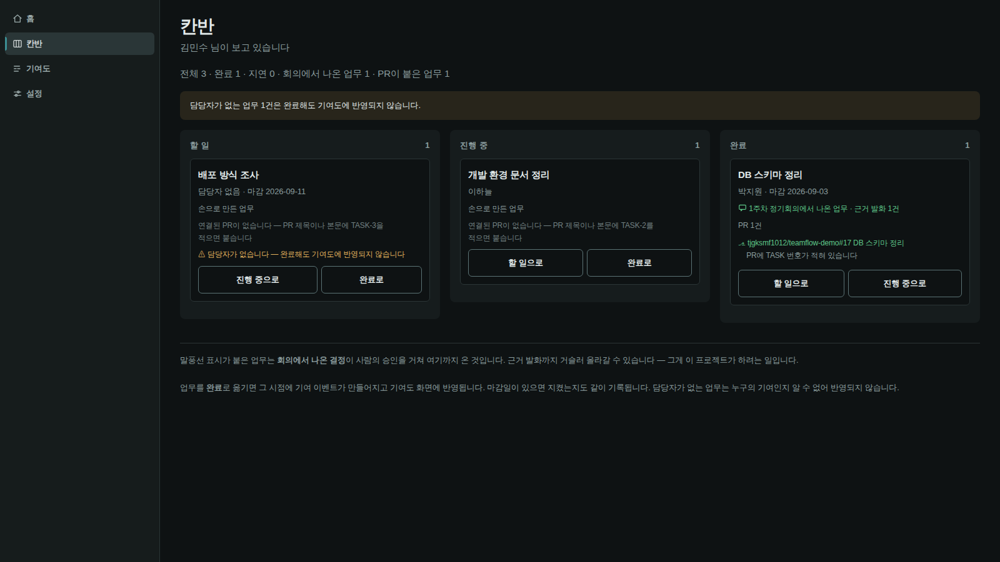
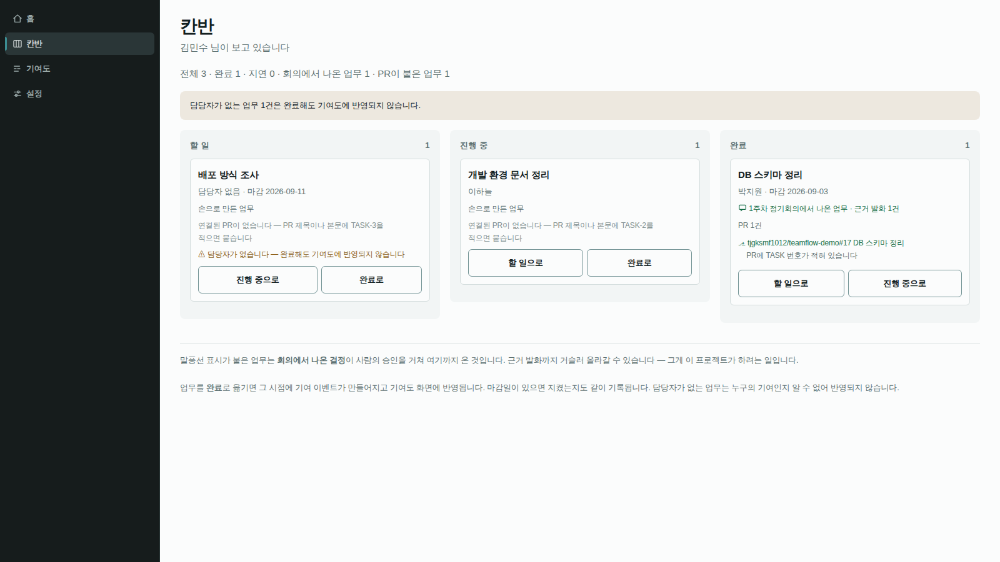
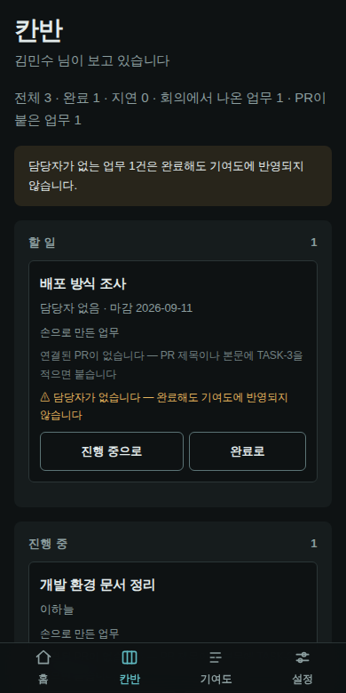

# 19. 메신저 셸로 전환 — 눈으로 보고 정한 것

> 이 문서는 **화면을 그려서 렌더하고 눈으로 본 뒤에** 쓴 것입니다. 글로 설명을
> 읽고 정한 것이 아닙니다. 이 저장소가 스물세 번 배운 것이 그것입니다 —
> **파일에서 읽은 것과 브라우저가 그리는 것은 다른 것입니다.**

---

## 1. 왜 바꾸는가 — 화장이 아니라 구조

지금 화면은 **탭 넷으로 페이지를 갈아 끼우는** 구조입니다. 그래서 회의가
**장소가 아니라 페이지**입니다. 칸반을 보러 가면 회의에서 나온 것이 됩니다.

그런데 이 제품이 실제로 하는 일을 적어 보면 메신저의 구조와 거의 그대로
겹칩니다.

| 이 제품 | 메신저 문법 |
|---|---|
| 프로젝트 | 왼쪽 서버 레일 |
| **회의** | **음성 채널** — 들어가고 나오는 방 |
| 업무 후보 검토 · 칸반 · 기여도 · 설정 | 채널 목록 |
| 참가자 상태 · 운행도표 | 오른쪽 멤버/맥락 사이드바 |
| 회의록 · 미해결 사안 | 스레드 패널 |

⚠️ **디스코드·슬랙·메타모스트의 색·로고·브랜드는 가져오지 않습니다.**
가져오는 것은 **구조 문법**뿐이고, 정체성은 TeamFlow 것으로 만듭니다.

---

## 2. 이 환경의 한계 — 먼저 적어 둡니다

참고 사이트를 **브라우저로 직접 열지 못했습니다.** 이 환경의 프록시가
`discord.com`·`slack.com`·`docs.mattermost.com` 으로의 CONNECT 를 403 으로
막습니다(`raw.githubusercontent.com` 만 통과). WebSearch 는 됩니다.

그래서 **남의 화면을 보는 대신 우리 화면을 그려서 봤습니다.** 판단해야 할
대상은 결국 디스코드 화면이 아니라 우리 화면이므로, 이 방법이 더 낫기도
합니다. 다만 **참고 사이트의 실측값은 이 문서에 없습니다** — 없는 것을
있는 척 적지 않습니다.

---

## 3. 눈으로 보고 찾은 것 — 네 판을 거쳤습니다

### v1 → v2 : 본문이 텅 빈다

칸반 열이 **내용 높이만큼만 서고** 아래 500px 가 비었습니다. 오른쪽 패널도
절반이 비었습니다. 메신저 셸에서 본문이 비어 보이면 셸이 실패한 것입니다.

- 열을 **전체 높이**로 세우고 각 열이 자기 스크롤을 갖게 했습니다
- 열 바닥에 `+ 업무 추가` 를 고정했습니다
- 오른쪽 패널을 **팀원 목록 + 이 회의에서 답이 안 난 것 + 다음 안건 + 동의**
  로 채웠습니다 — 멤버 목록만 두면 디스코드 흉내가 되고, 이 제품에는 이미
  보여줄 맥락이 있습니다

같이 고친 것: 활성 채널이 거의 안 보이던 것(배경을 올리고 **왼쪽 3px 막대**를
붙임) · 레일의 현재 위치 막대가 **레일 밖으로 나가 잘리던 것** · 한글 라벨에
`mono` + `uppercase` 를 써서 자간이 벌어지던 것 · 칸반과 기여도 아이콘이 서로
비슷하던 것.

### v3 : 라이트 테마가 무너졌다


표면 넷을 전부 흰색 근처(`#f2f5f4`·`#ffffff`·`#f7faf9`)로 두었더니 **계층이
통째로 뭉개졌습니다.** 채널 목록과 본문이 구분되지 않고 활성 표시도 아바타도
안 보였습니다.

그래서 **사이드바 둘은 짙게, 본문만 희게** 두는 쪽으로 갔습니다. 슬랙이
라이트에서도 사이드바를 어둡게 두는 이유가 이것이라고 봅니다 — 밝은 바탕 위에
표면 네 겹을 쌓으면 쌓을 자리가 없습니다.

### v3 → v4 : 토큰 하나를 두 역할로 썼다 ← **이번의 진짜 발견**

사이드바만 뒤집고 나니 이번엔 **칸반 열이 어두워졌습니다.** 추측하지 않고
계산된 색을 쟀습니다.

```
라이트 .col   배경 rgb(18,33,31)   글자 rgb(22,33,31)   ← 어두운 데 어두운 글자
```

원인은 색이 아니라 **토큰의 역할**이었습니다. `--s1` 하나를 **껍데기**(채널
목록)와 **내용 안에 파인 패널**(칸반 열) 두 곳에 같이 썼습니다. 다크에서는
둘 다 어두워 **우연히** 맞았고, 라이트에서 껍데기만 뒤집자 그 우연이
깨졌습니다.

> **한 계단으로 두 역할을 감당할 수 없습니다.** 색 계단을 둘로 가릅니다.

---

## 4. 색 계단 둘

```
껍데기 chrome — 레일 · 채널 목록 · 상태 바.   두 테마 다 짙다 (뒤집히지 않는다)
내용   content — 본문 · 맥락 패널 · 카드.      테마에 따라 뒤집힌다
```

### ⚠️ 정정 — 처음 적은 값은 **눈으로 고른 것**이었습니다

이 문서의 첫 판에는 제가 실험판에서 눈으로 고른 hex 열몇 개가 표로
적혀 있었습니다. 그런데 `tokens.css` 는 맨 위에 이렇게 적어 뒀습니다.

> ⚠️ **모든 색은 계산값입니다.** 눈으로 고른 값은 하나도 없습니다.
> 스파이크에서 눈으로 골랐다가 `--line` 대비를 1.46:1 로 만들었고,
> 그건 이 파일이 고치려던 결함 그 자체였습니다.

**제가 그 파일이 막으려던 일을 하고 있었습니다.** 구조(껍데기/내용 분리·
치수·밀도)는 눈으로 봐서 얻은 것이라 그대로 두고, **색만 다시 계산했습니다.**

### 내용 계단 — **이미 있습니다. 새로 만들지 않습니다**

`tokens.css` Layer 2 에 이미 네 단이 있고 테마에 따라 뒤집힙니다.

| 토큰 | 쓰임 |
|---|---|
| `--sunken` | 본문에 **파인** 것 — 칸반 열 · 맥락 패널 · 입력창 안쪽 |
| `--surface` | 카드 |
| `--bg` | 페이지 바닥 |
| `--raised` | 위로 **뜬** 것 |

실험판에서 제가 만든 `--s0~--s4` 는 이것의 두 번째 벌이었습니다. 버립니다.

### 껍데기 계단 — 새로 만든 것

색조는 Layer 1 과 같은 **183°**. 글자 3단과 강조는 **목표 대비를 처음 넘는
명도를 0.1% 씩 훑어서** 찾았고, 표면은 이 파일의 기준인 명도 간격 2~4%
를 따랐습니다.

| 토큰 | 값 | 기준면(채널 목록) 대비 | 쓰임 |
|---|---|---|---|
| `--chrome-rail` | `#0e1212` | 명도 −3.6% | 레일. 가장 깊다 |
| `--chrome-side` | `#161c1c` | — | 채널 목록. **기준면** |
| `--chrome-hover` | `#20292a` | 명도 +4.7% | 호버 |
| `--chrome-sel` | `#2a3637` | 명도 +9.2% | 선택 |
| `--chrome-line` | `#293535` | 1.36:1 | 선 (장식) |
| `--chrome-text` | `#d2d9d9` | **12.05:1** ✅ | 본문 글자 |
| `--chrome-muted` | `#99a8a8` | **7.00:1** ✅ | 중간 글자 |
| `--chrome-subtle` | `#738687` | **4.51:1** ✅ | 보조 글자 |
| `--chrome-accent` | `#3c8e93` | **4.51:1** ✅ | 현재 위치 막대 · 활성 아이콘 · 배지 |

교차 확인(레일 위·선택 위)도 전부 통과합니다 — 본문 13.17 / 8.72,
보조 4.93 / 3.26, 강조 4.92 / 3.26.

⚠️ **표면끼리는 대비비로 재지 않습니다.** 이 파일의 기준은 명도 간격
2~4% 입니다. 대비비로 재면 레일이 1.09:1 로 나오고 그걸 미달로 신고하게
되는데, **그건 잣대가 틀린 것**입니다. 실제로 한 번 그렇게 신고할 뻔했습니다.

### 결측은 껍데기 위에서도 흙빛입니다

⚠️ **제 실험판은 운행도표의 구멍을 빨간 빗금으로 그렸습니다.** `tokens.css`
가 명시적으로 금지한 것입니다 —

> 빨강이 아닙니다. 녹음이 끊긴 것은 오류가 아니라 결측이고, 빨강으로
> 그리면 사람은 "고장 났다" 로 읽습니다.

`--clay-600` 이 껍데기 위에서 **4.54:1**(밝은) · **5.75:1**(어두운) 로 둘 다
3:1 을 넘으므로 그대로 씁니다. 안 보였다면 누군가 빨강으로 바꿨을 것입니다.

### 이 값들을 지키는 가드

`backend/tests/test_design_tokens.py` 가 **파일이 적어 둔 비율을 매번 다시
잽니다.** 값을 손으로 고치면 옆의 `/* 7.02:1 ✅ */` 주석은 그대로 남는데,
주석은 안 틀리고 색만 틀립니다 — 화면에서는 색이 이깁니다.

되돌림 셋으로 확인했습니다 — 껍데기 글자색을 바꾸니 `12.05 → 11.00` 을
지목했고, 껍데기를 다크에서 다시 정의하니 잡았고, 껍데기를 흙빛과 같은
색으로 바꾸니 `1.02:1` 로 잡았습니다.

⚠️ **이 가드도 첫 판이 틀렸습니다.** 어두운 블록의 주장을 밝은 값으로
재서 `--primary-fg` 를 오보로 신고했습니다. **파일이 아니라 검사가
틀린 것**이었습니다.

## 5. 셸 치수

```
레일 72px │ 채널 목록 256px │ 본문 (남는 만큼) │ 맥락 패널 284px
머리 높이 50px · 채널 줄 높이 36px · 기본 글자 15px
```

**15px 를 고른 이유**: 13.5px(촘촘)·15px·16px(여유) 세 판을 렌더해 봤는데,
13.5px 는 한글에서 확실히 답답했습니다. 한글은 같은 광학 크기에서 라틴보다
큰 크기를 요구합니다. 16px 는 편하지만 사이드바가 무거워집니다.

### 좁은 화면 — 무엇을 먼저 버리는가

```
≤1240px   맥락 패널을 접는다        (레일 · 목록 · 본문)
≤880px    채널 목록도 접는다        (레일 · 본문)
≤560px    레일 56px · 칸반을 세로로
```

**레일과 본문은 끝까지 남습니다** — 어디에 있는지와 무엇을 보는지입니다.

⚠️ **찾은 결함**: 880px 아래에서 채널 목록이 사라지면 **회의로 갈 방법이
없어집니다.** 막다른 길입니다(`test_no_screen_is_a_dead_end` 가 막아 온 부류).
구현할 때 좁은 화면에서는 **채널 목록을 서랍으로 열 수 있게** 해야 합니다.
이 문서를 쓰는 시점에 아직 안 만들었습니다.

---

## 6. 지금 화면 열이 어디로 가는가

| 지금 | 새 셸에서 |
|---|---|
| `home.html` | 레일에서 프로젝트를 고르면 채널 목록이 열린다. 홈은 **프로젝트 선택 + 초대 코드** 자리로 줄어든다 |
| `lobby.html` | 회의 채널의 **본문** (동의 · 트랙 상태 · 종료) |
| `call.html` | 회의 채널에 **들어간 상태**. 상시 상태 바가 하단에 남는다 |
| `index.html` (녹음) | 통화와 같은 방. 녹음 준비는 본문 안의 단계로 |
| `review.html` | 채널 「업무 후보 검토」 + 회의록은 맥락 패널로 |
| `kanban.html` | 채널 「칸반」 |
| `contributions.html` | 채널 「기여도」 |
| `project.html` | 채널 「프로젝트 설정」 |
| `login.html` · `offline.html` | 셸 **밖**. 지금처럼 단독 |

---

## 7. 이 제품만의 것 — 흉내로 끝나지 않으려면

메신저에서 가져온 것은 구조뿐이고, 그 구조 위에 **이 제품에만 있는 것**을
올립니다.

1. **운행도표가 맥락 패널에 상주합니다.** 누가 언제 녹음이 끊겼는지가 회의
   중에도, 칸반을 보는 중에도 옆에 있습니다. 메신저의 멤버 목록에는 없는
   것입니다
2. **맥락 패널이 "답이 안 난 것"을 들고 있습니다.** 회의에서 결론이 안 난
   항목이 시각과 근거 건수와 함께 남습니다
3. **상태 점이 "측정 불가"를 말합니다.** 온라인/오프라인이 아니라
   커버리지입니다. 42% 인 사람은 회색 점 + 노란 글자로 **못 쟀다**고 말하지,
   0점이라고 말하지 않습니다


---

## 8. 불변식은 셸에서도 지켜야 합니다

| 불변식 | 셸에서 지키는 방법 |
|---|---|
| **순위·리더보드 금지** | 맥락 패널의 팀원 목록은 **가입 순** 고정입니다. 점수·비율로 정렬하지 않습니다. 배지에 숫자를 넣지 않습니다 |
| **단일 점수 금지** | 기여도 카드는 셸 안에서도 구간 + 신뢰도 + 사유 + 근거 건수를 그대로 유지합니다 |
| **측정 불가 ≠ 0점** | 커버리지가 낮은 사람은 **회색 점 + "측정 불가"** 입니다. 빨간 점(나쁨)도 아니고 0%도 아닙니다 |
| **시스템은 판정하지 않음** | 확정은 기여도 본문 안에 남고, 셸 어디에도 자동 확정 버튼을 두지 않습니다 |

---

## 9. 아직 안 한 것

- 좁은 화면의 **채널 목록 서랍** (§5 의 막다른 길)
- 채널을 옮길 때 **본문 머리말이 따라 바뀌는 것** (실험판은 머리말이 고정이었습니다)
- 활성 채널 표시를 현재 화면과 잇는 것
- 키보드 이동 · 포커스 표시 · 스크린리더에서 4열이 어떻게 읽히는지
- 실제 화면 열에 이 셸을 입히는 일 자체

---

## 10. 실행 결정 — 세 안을 심사하고 정한 것

방향 셋(**승강장** · **근거 열** · **명부 셸**)을 만들어 세 렌즈(제품
적합성·구현 가능성·미감과 접근성)로 심사했습니다. 그런데 **종합 단계에서
심사 자체의 오류가 먼저 나왔습니다.**

### ⚠️ 세 안이 전부 v3 붕괴를 다시 제안했습니다

세 안은 §4 의 껍데기 계단을 모르는 채로 설계됐고, **셋 다 밝은 모드에서
뒤집히는 밝은 네비 표면**을 제안했습니다 — 안1·안2 는 `--ink-100`(#e9eeee),
안3 은 `#e0e7e7`. 그게 정확히 §3 의 v3 입니다.

대비를 직접 재서 확인했습니다.

```
--text-subtle #5e7273 on --surface #f2f5f5   4.64:1  ← 두 안이 베낀 근거
--text-subtle #5e7273 on #e9eeee (안1·안2)   4.34:1  ✗ 미달
--text-subtle #5e7273 on #e0e7e7 (안3)       4.06:1  ✗ 미달
```

`tokens.css` 가 맨 위에 적어 둔 그대로입니다 — **주석은 안 틀리고 색만
틀립니다. 화면에서는 색이 이깁니다.** 반면 껍데기 계단 아홉은 다시 재 보니
주장과 소수 둘째 자리까지 일치했습니다(12.05 / 7.00 / 4.51 / 4.51).

**그래서 셸을 새로 설계하지 않습니다.** §4~§5 의 구조를 골격으로 확정하고,
세 안은 그 위에 무엇을 얹을지로만 씁니다. 색은 이미 계산돼 있고 가드도
붙어 있습니다. 남은 것은 **CSS 뿐**입니다.

### 고른 것

**골격 = §5 의 4열. 3열의 내용과 규율 = 「명부 셸」. 「근거 열」은 3단계로
연기. 「승강장」은 진단만 채택하고 처방은 버립니다.**

심사 표결은 근거 열이 이겼지만 **1단계로 둘 수 없습니다** — 근거 원문을
주는 엔드포인트가 실제로 **0개**입니다(`main.py` 에 `utterances` 0건, 확인).
지금 만들면 `review.ts` 가 그리는 `#101, #102` 를 384px 로 확대한 액자가
됩니다. **절반이 빈 상설 열은 열리는 패널보다 나쁩니다.**

반면 3열의 네 블록은 **오늘 있는 데이터로 전부 찹니다** — 동의 상태 ·
트랙 커버리지 · 미해결 사안 · 다음 안건.

⚠️ 다만 이름을 바꿉니다: **명부가 아니라 맥락 패널입니다.** 순위 금지가
제1 불변식인 제품에서 상설 열을 사람 목록에 주는 것은 스스로 낸 불에
소화기를 배치하는 일입니다. 사람은 네 블록 중 **하나**이고, 나머지 셋이
사람 블록이 순위표로 읽히는 것을 **구조적으로 희석**합니다.

### 세션 바를 정직하게 — 시계를 그리지 않습니다

`call.ts` 의 `RTCPeerConnection` 과 `main.ts` 의 `MediaRecorder` 는
**문서 이동에 죽습니다.** 그래서:

- 세션 바는 **회의 문서(lobby·call·index·review)에서만** 그립니다
- **경과 시간 타이머를 그리지 않습니다.** 죽은 `MediaRecorder` 를 가리키는
  시계는 이 저장소의 대표 결함(틀린 숫자를 조용히 보여주기)의 재현입니다.
  시계를 안 그리면 거짓말할 것이 없습니다
- 회의 채널을 떠날 때 **"나가면 녹음이 끊깁니다"** 를 그 자리에서 말합니다
- **자동 재입장 금지** — 동의 없는 녹음 재개가 됩니다

### 접붙일 조각

| 출처 | 조각 |
|---|---|
| 근거 열 | **근거 눈금** — 패널 왼쪽 4px 을 시간 홈통으로, 각 근거의 `start_ms` 위치에 2px 눈금. 근거가 "몇 건" 이 아니라 **"언제"** 로 읽힙니다. 순수 CSS. **3단계로 연기** |
| 근거 열 | **"선택 → 열림" 이 아니라 "선택 → 필터"** — 패널은 항상 있고 선택이 그것을 좁힙니다. 여닫는 법을 배울 것이 없습니다 |
| 근거 열 | **mono 서체를 "이 값은 기계가 잰 것" 의 표식으로** — 타임코드·구간·신뢰도·PR 번호가 전부 mono 로 떨어지면 "근거 없는 값 금지" 가 서체 대비로 드러납니다. 웹폰트 없이 얻는 유일한 공짜 레버 |
| 근거 열 | **래퍼 없는 구현** — `position: fixed` + `body` 패딩. `#tabs` 가 지금 그 방식입니다 |
| 명부 셸 | **걸러내기는 순위가 아니지만 재정렬은 순위다** — 필터 허용, 정렬 컨트롤 금지 |
| 명부 셸 | **집계는 사람이 아니라 항목을 센다** — "확인이 필요한 항목 3건" 이지 "문제 있는 사람 2명" 이 아닙니다 |
| 명부 셸 | **`role="list"` / `role="listitem"`** — `li` 오염을 피하면서 목록 의미 유지 |
| 명부 셸 | **모르는 것을 오프라인이라 말하는 건 거짓말** — 회의 맥락이 없는 화면에서는 실시간 상태점을 회색으로도 안 그립니다 |
| 승강장 | **퇴장 비대칭** — 입장은 동의를 거쳐 신중히, 나가기는 항상 같은 자리. 마지막 퇴장은 **서버가** 판정 |
| 승강장 | **"녹음 중" 을 빨강으로 안 그린다** — 세 시간 내내 빨간 점이 켜져 있으면 진짜 `--bad` 가 안 보입니다 |

### 버릴 것

1. **새 네비 표면 토큰 전부** — `--chrome-*` 아홉이 이미 계산값·가드 포함으로 있습니다
2. **`--text-subtle` 을 껍데기에 올리는 것** — 실측 4.34/4.06:1 미달. 껍데기 위 보조 글자는 `--chrome-subtle`(4.51:1)
3. **iframe 최상위 문서** — 스크린리더에서 랜드마크가 문서 경계를 못 넘어 "3열이 어떻게 읽히는가" 의 답이 "하나의 구조로 안 읽힌다" 가 됩니다. Ctrl+F 가 한 프레임만 훑고, 새로고침 한 번에 회의가 끊깁니다. 게다가 새 `app.html` 도 `id="tabs"` 를 강제당해 **`#tabs` 가 둘** 생깁니다
4. **레일에 사람별 커버리지 막대·퍼센트 상시 노출** — 캡션이 무엇이든 리더보드이고, 폰이 잠긴 사람이 **모든 화면에서 영구히 결손**으로 보입니다
5. **문서 이동을 넘어 세션이 산다는 약속**과 경과 시간 시계
6. **셸 크롬의 `<ul><li>`** — `lobby.html:24` 의 `li{display:grid}` 와 `index.html:22` 의 `li::before{content:"· "}` 가 그 두 화면에서만 조용히 깨뜨립니다 (실측 확인)
7. **`#tabs` id 변경 · 탭 개수 변경** — `GLOBAL_IDS`(guards:270) + `links.test.ts` 28개 + `test_no_screen_is_a_dead_end`
8. **`#shell { display: grid }`** — id 에 레이아웃 금지. 역할 클래스만
9. **정보를 감추는 조밀 모드** — 근거·타임코드·신뢰도는 조밀에서도 남습니다. 여백과 아바타만 뺍니다
10. **결측을 빨강으로** — §4 가 명시 금지
11. **`role="application"`**
12. **밝은 모드에서 껍데기를 밝게 뒤집는 것** — `test_the_chrome_ladder_does_not_flip_in_dark_mode` 가 막습니다

### 심사가 틀렸던 것 (실측 정정)

| 주장 | 실측 |
|---|---|
| "사람별 GitHub 계정 매핑 API 없음" | **거짓.** `main.py` 에 `github_login` · `set_my_github_login` 존재 |
| "`build.mts` 에 진입점 추가 필요" | **거짓.** `entryPoints()` 가 `public/*.html` 을 훑어 자동 발견 |
| "`links.test.ts` 17개" | **28개** |
| "utterances 엔드포인트 0개" | **참** — 근거 열을 연기하는 근거가 됐습니다 |
| "`sw.js` 에 `tokens.css` 없음" | **참.** `/tokens.css`·`/call.html`·`/call.js` 누락 — 별건으로 고칠 것 |

---

## 11. 1단계 구현 — `#tabs` 를 세웠습니다

**새 DOM 을 하나도 만들지 않았습니다.** `#tabs` 는 이미 `position: fixed`
이고 `src/demo/nav.ts` 가 채웁니다. 그 안의 링크가 곧 채널 목록 항목이므로
**id·링크·개수를 그대로 두고 CSS 로 방향만 세로로 돌렸습니다.**

그래서 `GLOBAL_IDS` · `links.test.ts` · 막다른 길 검사가 전부 그대로
통과합니다. 그리고 —

⚠️ **§9 에 적어 둔 폰 막다른 길이 아예 생기지 않았습니다.** 좁은 화면에서는
채널 목록을 *접는* 것이 아니라 **원래 모양(아래 탭바)으로 돌아가는** 것이기
때문입니다. 서랍을 만들 필요가 없었습니다 — 실험판에서 `display: none` 으로
지웠던 것이 문제였지, 구조가 문제가 아니었습니다.

### 기준선을 90rem(1440px)으로 잡은 이유

본문에 최소 720px 은 남겨야 칸반 열 셋이 읽힙니다. 목록 256px 을 빼면
1440px 부터입니다. 48~90rem 에서는 지금의 위쪽 가로 내비가 그대로 돕니다.

### 렌더해서 보고 고친 것

**레일 자리를 미리 비워 뒀다가 뺐습니다.** `--shell-rail`(72px)만큼 왼쪽을
띄웠더니 **아무것도 없는 72px 이 생겼습니다.** 레일은 프로젝트 전환용인데
그 화면이 아직 없습니다 — 없는 것을 위해 자리를 비워 두면 그건 빈칸이
아니라 결함입니다. 생길 때 더합니다.

**기존 가드가 제 `gap: 2px` 를 잡았습니다.** 이 저장소는 4px 격자만 쓰고
6px 은 아이콘↔텍스트에만 허용합니다(지시서 §4.3). `var(--sp-1)` 로 고쳤습니다.





1600·1200·390px 세 폭과 두 테마에서 **가로 넘침 0px**, 콘솔 오류는 401
하나(로그인 전 `/api/auth/me` 조회 — 결함 115 에서 처리한 그 길)뿐입니다.

### 아직 안 한 것

- 채널 목록 **머리말**(프로젝트 이름)과 **바닥 상태 바**
- **맥락 패널**(팀원·미해결 사안·다음 안건·동의) — 3열
- **회의 채널** 자체. 지금 목록은 홈·칸반·기여도·설정 넷뿐이고 회의는
  아직 채널이 아닙니다. 이것이 이 개편의 핵심이라 다음 단계입니다
- 프로젝트 레일
