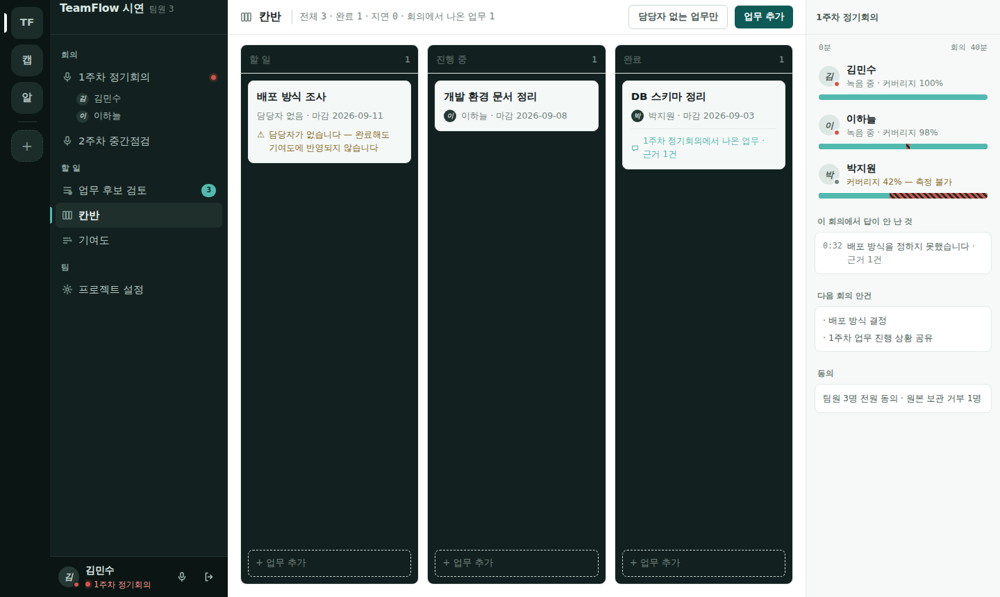
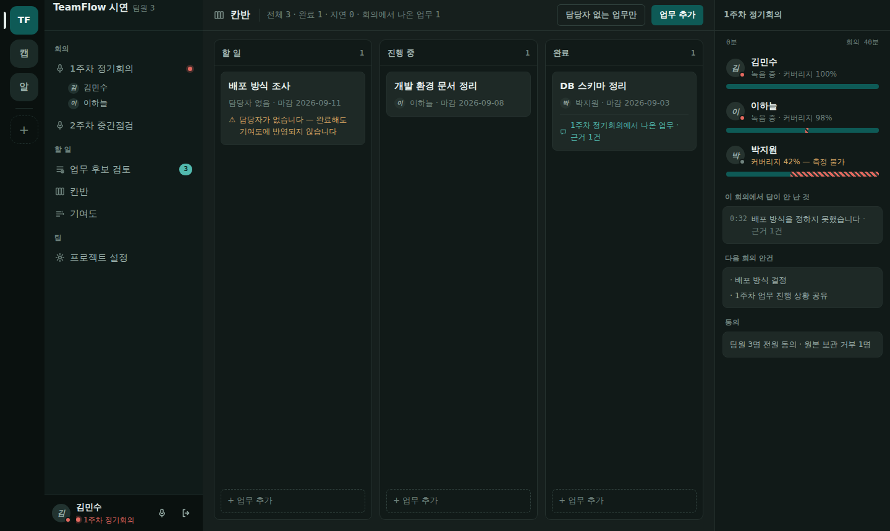
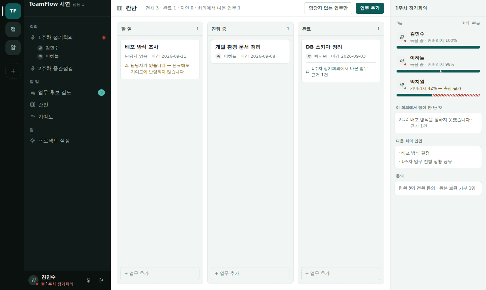
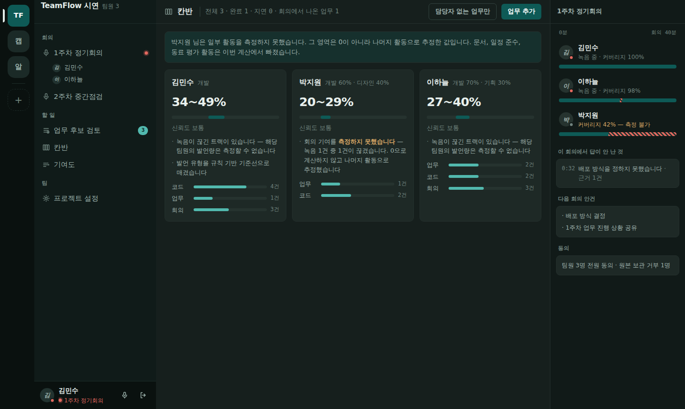
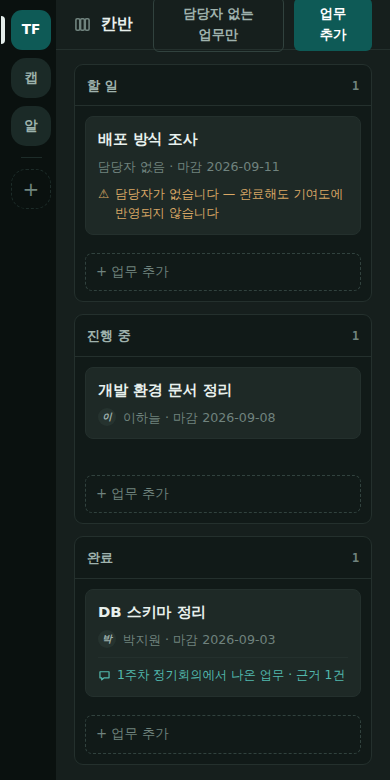

# 19. 메신저 셸로 전환 — 눈으로 보고 정한 것

> 이 문서는 **화면을 그려서 렌더하고 눈으로 본 뒤에** 쓴 것입니다. 글로 설명을
> 읽고 정한 것이 아닙니다. 이 저장소가 스물세 번 배운 것이 그것입니다 —
> **파일에서 읽은 것과 브라우저가 그리는 것은 다른 것입니다.**

---

## 1. 왜 바꾸는가 — 화장이 아니라 구조

지금 화면은 **탭 넷으로 페이지를 갈아 끼우는** 구조입니다. 그래서 회의가
**장소가 아니라 페이지**입니다. 칸반을 보러 가면 회의에서 나온 것이 됩니다.

그런데 이 제품이 실제로 하는 일을 적어 보면 메신저의 구조와 거의 그대로
겹칩니다.

| 이 제품 | 메신저 문법 |
|---|---|
| 프로젝트 | 왼쪽 서버 레일 |
| **회의** | **음성 채널** — 들어가고 나오는 방 |
| 업무 후보 검토 · 칸반 · 기여도 · 설정 | 채널 목록 |
| 참가자 상태 · 운행도표 | 오른쪽 멤버/맥락 사이드바 |
| 회의록 · 미해결 사안 | 스레드 패널 |

⚠️ **디스코드·슬랙·메타모스트의 색·로고·브랜드는 가져오지 않습니다.**
가져오는 것은 **구조 문법**뿐이고, 정체성은 TeamFlow 것으로 만듭니다.

---

## 2. 이 환경의 한계 — 먼저 적어 둡니다

참고 사이트를 **브라우저로 직접 열지 못했습니다.** 이 환경의 프록시가
`discord.com`·`slack.com`·`docs.mattermost.com` 으로의 CONNECT 를 403 으로
막습니다(`raw.githubusercontent.com` 만 통과). WebSearch 는 됩니다.

그래서 **남의 화면을 보는 대신 우리 화면을 그려서 봤습니다.** 판단해야 할
대상은 결국 디스코드 화면이 아니라 우리 화면이므로, 이 방법이 더 낫기도
합니다. 다만 **참고 사이트의 실측값은 이 문서에 없습니다** — 없는 것을
있는 척 적지 않습니다.

---

## 3. 눈으로 보고 찾은 것 — 네 판을 거쳤습니다

### v1 → v2 : 본문이 텅 빈다

칸반 열이 **내용 높이만큼만 서고** 아래 500px 가 비었습니다. 오른쪽 패널도
절반이 비었습니다. 메신저 셸에서 본문이 비어 보이면 셸이 실패한 것입니다.

- 열을 **전체 높이**로 세우고 각 열이 자기 스크롤을 갖게 했습니다
- 열 바닥에 `+ 업무 추가` 를 고정했습니다
- 오른쪽 패널을 **팀원 목록 + 이 회의에서 답이 안 난 것 + 다음 안건 + 동의**
  로 채웠습니다 — 멤버 목록만 두면 디스코드 흉내가 되고, 이 제품에는 이미
  보여줄 맥락이 있습니다

같이 고친 것: 활성 채널이 거의 안 보이던 것(배경을 올리고 **왼쪽 3px 막대**를
붙임) · 레일의 현재 위치 막대가 **레일 밖으로 나가 잘리던 것** · 한글 라벨에
`mono` + `uppercase` 를 써서 자간이 벌어지던 것 · 칸반과 기여도 아이콘이 서로
비슷하던 것.

### v3 : 라이트 테마가 무너졌다



표면 넷을 전부 흰색 근처(`#f2f5f4`·`#ffffff`·`#f7faf9`)로 두었더니 **계층이
통째로 뭉개졌습니다.** 채널 목록과 본문이 구분되지 않고 활성 표시도 아바타도
안 보였습니다.

그래서 **사이드바 둘은 짙게, 본문만 희게** 두는 쪽으로 갔습니다. 슬랙이
라이트에서도 사이드바를 어둡게 두는 이유가 이것이라고 봅니다 — 밝은 바탕 위에
표면 네 겹을 쌓으면 쌓을 자리가 없습니다.

### v3 → v4 : 토큰 하나를 두 역할로 썼다 ← **이번의 진짜 발견**

사이드바만 뒤집고 나니 이번엔 **칸반 열이 어두워졌습니다.** 추측하지 않고
계산된 색을 쟀습니다.

```
라이트 .col   배경 rgb(18,33,31)   글자 rgb(22,33,31)   ← 어두운 데 어두운 글자
```

원인은 색이 아니라 **토큰의 역할**이었습니다. `--s1` 하나를 **껍데기**(채널
목록)와 **내용 안에 파인 패널**(칸반 열) 두 곳에 같이 썼습니다. 다크에서는
둘 다 어두워 **우연히** 맞았고, 라이트에서 껍데기만 뒤집자 그 우연이
깨졌습니다.

> **한 계단으로 두 역할을 감당할 수 없습니다.** 색 계단을 둘로 가릅니다.

---

## 4. 색 계단 둘

```
껍데기 chrome — 레일 · 채널 목록 · 상태 바.   두 테마 다 짙다
내용   content — 본문 · 맥락 패널 · 카드.      테마에 따라 뒤집힌다
```

| 토큰 | 뜻 | 다크 | 라이트 |
|---|---|---|---|
| `--c-rail` | 레일 (가장 깊다) | `#0a110f` | `#0a110f` |
| `--c-side` | 채널 목록 | `#101b19` | `#101b19` |
| `--c-hover` | 껍데기 호버 | `#1b2a27` | `#1b2a27` |
| `--c-sel` | 껍데기 선택 | `#223330` | `#223330` |
| `--c-line` | 껍데기 선 | `#1d2c29` | `#1d2c29` |
| `--c-ink` / `--c-ink2` / `--c-ink3` | 껍데기 글자 3단 | `#e3edea` / `#9cb2ac` / `#6f847e` | 같음 |
| `--bg` | 본문 바닥 | `#161f1d` | `#ffffff` |
| `--sunken` | 본문에 **파인** 것 (칸반 열·맥락 패널) | `#111a18` | `#f1f5f4` |
| `--raised` | 본문 위로 **뜬** 것 (카드) | `#1e2926` | `#ffffff` |
| `--hover` | 내용 호버 | `#26332f` | `#eef3f1` |
| `--line` / `--line2` | 내용 선 | `#24302d` / `#31423e` | `#e1e9e6` / `#ccd8d4` |
| `--ink` / `--ink2` / `--ink3` | 내용 글자 3단 | `#e8f0ed` / `#9fb2ad` / `#70837e` | `#16211f` / `#4d5b57` / `#76847e` |
| `--teal` | 강조 | `#52b9ae` | `#0e5a56` |
| `--teal-solid` | 채워진 버튼·막대 | `#0e5a56` | `#0e5a56` |
| `--live` | 녹음 중 | `#e4695f` | `#bf4238` |
| `--warn` / `--ok` | 주의 / 좋음 | `#d9a765` / `#67bb8b` | `#7d5f18` / `#2c6b48` |

**중성색을 초록 쪽으로 기울였습니다.** 제품 색인 딥 틸(`#0e5a56`)과 한 벌로
읽히게 하려는 것이고, 디스코드의 푸른 회색·슬랙의 자주와도 갈립니다.
딥 틸은 **버립니다가 아니라 유지**합니다 — 이미 제품의 정체성입니다.

⚠️ 내용 영역 안의 아바타는 **내용 색**을 씁니다(`.panel .av`, `.card .av`).
껍데기 색을 그대로 쓰면 라이트에서 흰 바탕에 어두운 원이 떠 버립니다.

---

## 5. 셸 치수

```
레일 72px │ 채널 목록 256px │ 본문 (남는 만큼) │ 맥락 패널 284px
머리 높이 50px · 채널 줄 높이 36px · 기본 글자 15px
```

**15px 를 고른 이유**: 13.5px(촘촘)·15px·16px(여유) 세 판을 렌더해 봤는데,
13.5px 는 한글에서 확실히 답답했습니다. 한글은 같은 광학 크기에서 라틴보다
큰 크기를 요구합니다. 16px 는 편하지만 사이드바가 무거워집니다.

### 좁은 화면 — 무엇을 먼저 버리는가

```
≤1240px   맥락 패널을 접는다        (레일 · 목록 · 본문)
≤880px    채널 목록도 접는다        (레일 · 본문)
≤560px    레일 56px · 칸반을 세로로
```

**레일과 본문은 끝까지 남습니다** — 어디에 있는지와 무엇을 보는지입니다.

⚠️ **찾은 결함**: 880px 아래에서 채널 목록이 사라지면 **회의로 갈 방법이
없어집니다.** 막다른 길입니다(`test_no_screen_is_a_dead_end` 가 막아 온 부류).
구현할 때 좁은 화면에서는 **채널 목록을 서랍으로 열 수 있게** 해야 합니다.
이 문서를 쓰는 시점에 아직 안 만들었습니다.

---

## 6. 지금 화면 열이 어디로 가는가

| 지금 | 새 셸에서 |
|---|---|
| `home.html` | 레일에서 프로젝트를 고르면 채널 목록이 열린다. 홈은 **프로젝트 선택 + 초대 코드** 자리로 줄어든다 |
| `lobby.html` | 회의 채널의 **본문** (동의 · 트랙 상태 · 종료) |
| `call.html` | 회의 채널에 **들어간 상태**. 상시 상태 바가 하단에 남는다 |
| `index.html` (녹음) | 통화와 같은 방. 녹음 준비는 본문 안의 단계로 |
| `review.html` | 채널 「업무 후보 검토」 + 회의록은 맥락 패널로 |
| `kanban.html` | 채널 「칸반」 |
| `contributions.html` | 채널 「기여도」 |
| `project.html` | 채널 「프로젝트 설정」 |
| `login.html` · `offline.html` | 셸 **밖**. 지금처럼 단독 |

---

## 7. 이 제품만의 것 — 흉내로 끝나지 않으려면

메신저에서 가져온 것은 구조뿐이고, 그 구조 위에 **이 제품에만 있는 것**을
올립니다.

1. **운행도표가 맥락 패널에 상주합니다.** 누가 언제 녹음이 끊겼는지가 회의
   중에도, 칸반을 보는 중에도 옆에 있습니다. 메신저의 멤버 목록에는 없는
   것입니다
2. **맥락 패널이 "답이 안 난 것"을 들고 있습니다.** 회의에서 결론이 안 난
   항목이 시각과 근거 건수와 함께 남습니다
3. **상태 점이 "측정 불가"를 말합니다.** 온라인/오프라인이 아니라
   커버리지입니다. 42% 인 사람은 회색 점 + 노란 글자로 **못 쟀다**고 말하지,
   0점이라고 말하지 않습니다






---

## 8. 불변식은 셸에서도 지켜야 합니다

| 불변식 | 셸에서 지키는 방법 |
|---|---|
| **순위·리더보드 금지** | 맥락 패널의 팀원 목록은 **가입 순** 고정입니다. 점수·비율로 정렬하지 않습니다. 배지에 숫자를 넣지 않습니다 |
| **단일 점수 금지** | 기여도 카드는 셸 안에서도 구간 + 신뢰도 + 사유 + 근거 건수를 그대로 유지합니다 |
| **측정 불가 ≠ 0점** | 커버리지가 낮은 사람은 **회색 점 + "측정 불가"** 입니다. 빨간 점(나쁨)도 아니고 0%도 아닙니다 |
| **시스템은 판정하지 않음** | 확정은 기여도 본문 안에 남고, 셸 어디에도 자동 확정 버튼을 두지 않습니다 |

---

## 9. 아직 안 한 것

- 좁은 화면의 **채널 목록 서랍** (§5 의 막다른 길)
- 채널을 옮길 때 **본문 머리말이 따라 바뀌는 것** (실험판은 머리말이 고정이었습니다)
- 활성 채널 표시를 현재 화면과 잇는 것
- 키보드 이동 · 포커스 표시 · 스크린리더에서 4열이 어떻게 읽히는지
- 실제 화면 열에 이 셸을 입히는 일 자체
