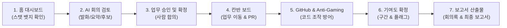

# TeamFlow AI — 실사용 E2E 워크플로우 시연 가이드

TeamFlow AI의 실기기 인프로세스 AI 모델(RTX 4090: Qwen3-ASR 1.7B + Qwen2.5-LLM)과 가독성이 개선된 모던 UI/UX를 직접 체험할 수 있는 가이드입니다.

---

## 1. 빠른 시작 (Quick Start)

### ① 로컬 서버 기동
터미널에서 아래 명령을 실행하거나, 루트 디렉터리의 `run_demo.bat`를 실행합니다:

```powershell
.venv\Scripts\python -X utf8 scripts/run_app.py
```

### ② 브라우저 또는 데스크톱 셸 접속
- **모던 리디자인 SPA 대시보드**: [http://127.0.0.1:8811/app/](http://127.0.0.1:8811/app/)
- **시연 계정 로그인 화면**: [http://127.0.0.1:8811/login.html](http://127.0.0.1:8811/login.html)
  - 이메일: `minsu@example.com`
  - 비밀번호: `teamflow-demo`
- **데스크톱 앱 (Electron)**: 루트 디렉터리의 `run_desktop.bat`를 더블클릭하여 백그라운드 무중단 녹음이 지원되는 데스크톱 앱으로 즉시 실행할 수 있습니다.

---

## 2. 핵심 시연 시나리오 6단계



### 1단계: 홈 대시보드 (`/app/`)
1. 로그인 후 홈 화면에 진입합니다.
2. 상단 헤더의 **스탯 뱃지**(`팀원 3`, `회의 6`, `검토 필요 2`)를 확인합니다.
3. 목록 최상단의 **검토 필요 회의**(`실기기 AI 분석 시연 회의 (2주차)`) 우측의 **`검토하기`** 버튼을 클릭합니다.

### 2단계: 실기기 AI 회의 검토 (`/app/meeting/6/review`)
1. **좌측 타임라인**:
   - Qwen3-ASR 실기기 모델이 직접 전사한 2인(김민수, 이하늘)의 발화 텍스트와 타임스탬프를 확인합니다.
   - 각 발화 행의 `▶ 듣기` 버튼을 눌러 실제 오디오 스트림 재생을 확인합니다.
   - 상단 접기/펼치기에서 Qwen2.5-LLM이 요약한 내용과 미해결 안건을 확인합니다.
2. **우측 업무 후보 카드**:
   - AI가 대화에서 자동 추출한 업무 후보(`로그인 API 개발` 등)를 확인합니다.
   - 상단 헤더의 `AI 초안`, `확신도`, `?`(추출 사유 툴팁)을 확인합니다.
   - 담당자(`Picker`) 및 마감일(`DatePicker`)을 선택/수정합니다.
3. **승인/거절 처리**:
   - `등록` 버튼을 눌러 승인 상태로 전환합니다.
   - 모든 후보의 처리가 완료되면 상단 헤더 우측의 **`검토 끝내기`** 버튼이 활성화됩니다.
   - **`검토 끝내기`**를 누르면 승인된 후보들이 실제 칸반 보드의 업무(`Task`)로 생성됩니다.

### 3단계: 칸반 보드 연동 (`/app/project/1/kanban`)
1. 좌측 레일의 **칸반 아이콘**을 클릭하여 칸반 보드로 이동합니다.
2. 방금 검토에서 승인한 업무 카드가 **`할 일`** 열에 생성되어 있는 것을 확인합니다.
3. **드래그 앤 드롭** 또는 키보드 숫자 키(`1`~`4`)를 눌러 카드를 `진행 중`, `완료` 열로 이동해 봅니다.
4. 카드의 `⋯` 메뉴를 열어 우선순위 변경, 담당자 토글, 삭제 등을 테스트합니다.
5. 카드 하단의 **근거 사슬**(`Chain`)을 확인합니다:
   - `근거`: 클릭 시 방금 검토했던 회의록의 원문 발화 위치로 즉시 이동합니다.
   - `PR`: GitHub PR 연결 상태 및 자동 연결 규칙(`TASK-n`)을 확인합니다.

### 4단계: GitHub 코드 연동 & Anti-Gaming 조작 저항성 증명
루트 디렉터리의 `run_github_demo.bat`를 실행하거나 터미널에서 실행합니다:
```powershell
.venv\Scripts\python -X utf8 scripts/run_github_demo.py --reset
```
1. **정상 개발자 (김민수)**:
   - 기능 구현 180줄 + 테스트 60줄 + 동료 리뷰 PR 1건 ➔ 정상 점수 반영.
2. **오타 스팸 조작 시도 (이하늘)**:
   - README 오타 수정 30건 PR 스팸 및 셀프 머지 ➔ 사소 변경 감쇠(`0.25배`)와 카테고리 천장에 걸려 실제 구현 대비 10분의 1도 안 되는 점수로 억제됨.
   - 기여도 카드에 무결성 경고 뱃지(`trivial_pr_spam`, `no_external_review`)가 부착됨.
3. **lockfile 조작 시도 (박지원)**:
   - 3,000줄 `package-lock.json` 변경 ➔ diff 필터에서 100% 배제되어 **0점** 반영.

### 5단계: 기여도 화면 검토 (`/app/project/1/contributions`)
1. 좌측 레일의 **기여도 아이콘**(구간 기호)을 클릭합니다.
2. **기여도 4대 불변식** 및 방금 주입된 Anti-Gaming 방어 결과를 확인합니다:
   - **순위/리더보드 없음**: 팀원들이 이름순으로 고정 정렬되어 있습니다.
   - **단일 점수 없음**: `34% ~ 58%`와 같은 **구간 추정치**와 **모르는 폭**(`Stat`)으로 표시됩니다.
   - **근거 사슬**: `회의`, `업무`, `코드` 각 범주별 실제 기여 이벤트 건수(예: `코드 1건`, `코드 31건`)가 투명하게 노출됩니다.
   - **무결성 경고 확인**: 이하늘 카드의 `모름` 옆 `?` (Why 팝오버)를 클릭하여 조작 탐지 경고(`병합된 PR 대부분이 사소한 변경만 담고 있습니다`, `병합된 PR이 모두 외부 리뷰 없이 처리되었습니다`)가 화면에 명확히 표출되는지 확인합니다.
3. 하단의 **팀 합의 확정 폼**:
   - 관리자가 팀원들과 논의하여 최종 기여 비율을 입력하고 확정할 수 있는 폼을 확인합니다.

### 6단계: 회의록 및 최종 보고서 확인 (`/reports.html?project=1`)
1. 브라우저에서 [http://127.0.0.1:8811/reports.html?project=1](http://127.0.0.1:8811/reports.html?project=1) 에 접속합니다.
2. 좌측 목록에서 자동 생성된 보고서들을 확인합니다:
   - **`회의록 — 실기기 AI 분석 시연 회의 (2주차)`**: AI가 요약한 회의 결과, 결정 사항, 업무 후보 등록 현황, 미해결 안건.
   - **`최종 보고서 — TeamFlow 시연 프로젝트`**: 프로젝트 기여도 합의값, 활동 통계, 불변식 준수 산출물.
3. 우측 상단의 **`텍스트 복사`** 버튼으로 외부 공유용 문서를 원클릭으로 추출할 수 있습니다.

---

## 3. 새로운 AI 회의 직접 돌려보기

새로운 회의를 실기기 AI 파이프라인으로 언제든 다시 분석할 수 있습니다:

```powershell
.venv\Scripts\python -X utf8 scripts/run_ai_e2e_demo.py
```
- GPU: RTX 4090
- 피크 VRAM: **약 7.0 GB** (24GB 중 29%만 점유, 17GB 이상 여유)
- 처리 시간: 약 10~15초 내외
